2024年10月11日-14日 北部九州
#########################################

中国で電車に乗ったらバスに乗りたくなったのでSUNQパスで九州乗りバス旅へ。

10月11日 バスタ新宿 - はかた号
-----------------------------------------

退勤後家でミートソースパスタを詰め込んでバスタ新宿へ。少し仕事の方が長引いてしまってなかなか慌ただしくなってしまった。夜発は早起きの必要性がなくて気に入っているけれど、時間の余裕が無いと少し厳しいな。香港行きやスキーバスはもっと遅いからよいけれど、今年も渡道を退勤後のフライトで計画してしまったので少し心配だ。そっちは家でご飯にする余裕すらないだろうから退勤さえミスらないだけだから少し楽だろうか。一度夜行バスに乗りそびれたのを結構引きずっている。

はかた号 バスタ新宿 - 駿河湾沼津SA
============================================

.. figure:: ./2024年10月11日-14日_北部九州/PXL_20241011_113629523.jpg

    九州でゴキブリのように走っている西鉄バスに東京でも乗れる。ここに意味がある。正直名古屋行きのどんたく気になる。

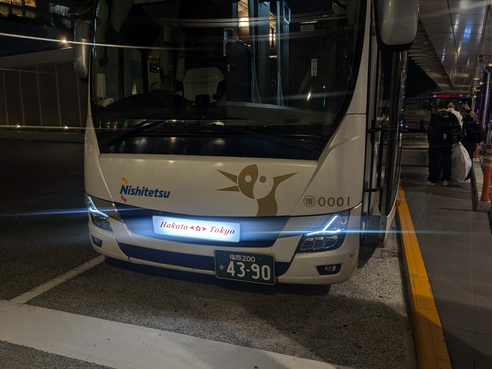

    スマホのレンズが汚すぎて夜はめっちゃ光芒が入る。申し訳ない。

前回は乗りそびれたから、バスタ新宿からバスに乗るのは2度目だ。どこから上がるのが簡単なのかすらよく分かっていなかったけれど、どうせ新南改札だろうという予想が当たってよかった。前回は小田急からだったから甲州街道から3階を経由して上がったんだったかな。私鉄系バスよりはJR系バスの方が馴染みがあるし、生活が城東に寄っているから東京駅周辺の高速バスターミナルでことは足りる。新宿からだと圧倒的にスキーバスのことが多い。結局のところバスタ新宿に発着するのは高級路線が多く、海外や国内他都市のバスターミナルのような雰囲気には乏しい、と思う。

はかた号もそんな高級路線の一つで、3連休前で片道18,000円した。LCCだったら2往復くらい出来ても不思議じゃない価格だ。3列座席だし15時間もバスに乗れるのであれば個人的には高くない [#]_ 、と思うのだが高いとそれはそれで客層が合わないらしい。3月の山形行きの夜行バスのように疲れ果てたおっさんではなく、お洒落な若者に、旅慣れてそうなおばあちゃん、というように見える。極めつけはミニスカとロングブーツのネーチャンである。それは果たして夜行バスに乗る服装なのだろうか [#]_ 。香港行きの飛行機だって決してキラキラしていないわけではないのだけど、もう少し旅慣れた人が集まっている。

キングオブ深夜バス [#]_ と呼ばれて苦行の代名詞に挙げられたはかた号も今は、時間はあるが飛行機に乗れない/乗りたくない、というニッチな需要をガッチリとつかんでおり趣味者は少ない。ライオンズエクスプレスは4列座席でさすがに苦行と呼べたろうが、3列主体、一部は2列個室という現状はどう見ても苦行ではないだろう。乗車後にはお茶とホットアイマスクを配ってくれる。座席に置いておいてくれればいいような気もするけどこれがサービスってものなのだろうか。

夜行バスらしくなくカーテンは開けっ放しで、最初の休憩になる静岡SAまでこのままらしい。どうせ日が暮れた21時発なのだから閉めてあってもよいかと思うけど、少しでも車窓が楽しめるのはありがたい。しかし東名の右ルート工事中で渋滞を眺めることになってしまった。休憩先も駿河湾沼津SAに変更になるらしい、がいつも22時くらいには床に就くようにしている健康優良児としてはもう眠い。夜行バスは眠気が来ているうちに寝ないとどうしようもない、寝よう。

夜中減速と再加速の音で目が覚める。くそあちい。乗った時から暑かったから、少し空調の温度を下げてもらえるように言っておくべきだったかな。どうも新名神も工事中でその渋滞に捕まったらしい。本線上でストップアンドゴーとは追突されそうで怖い。

10月12日 はかた号 - 福岡 - 長崎 - 雲仙
----------------------------------------------------------------------

はかた号 広島沼田PA - 西鉄天神高速BT
============================================

渋滞を抜けたら空調が効いてきたのか8時過ぎにPA休憩の案内が入るまでぐっすりだった。短距離路線だとなかなか睡眠時間が確保しづらいけれどこういう超長距離線であれば十分だ。素直に休憩して朝ごはんを調達する。といってもおにぎり2つの簡単なものだけど。

バスは1時間ほど遅れていて、山口県内の休憩を予定していたがそれを早めての休憩となったらしい。おかげでカーテンを閉めて通過していたはずの宮島などを望むことが出来る。中国地方はどこも花崗岩だらけで普通の低山も見ていて楽しい。鉄道だと海が印象的な区間だけれど、高速道路はそれよりも山側に引かれているのでそちらの方が目に付く。防府も海が近く、後ろには花崗岩の山がそびえていて少し気になる。山口は観光地がバラバラしていてなかなか行きづらい。やはりレンタカーなのだろうが、北海道以外だと渋滞に巻き込まれそうで気が進まない。

中国道との合流で大渋滞、と思ったら小郡JCT周辺が工事で片側一車線に減らされている影響らしい。その後は秋吉台などを遠望しつつ順調に走り関門橋を越えて九州に入る。

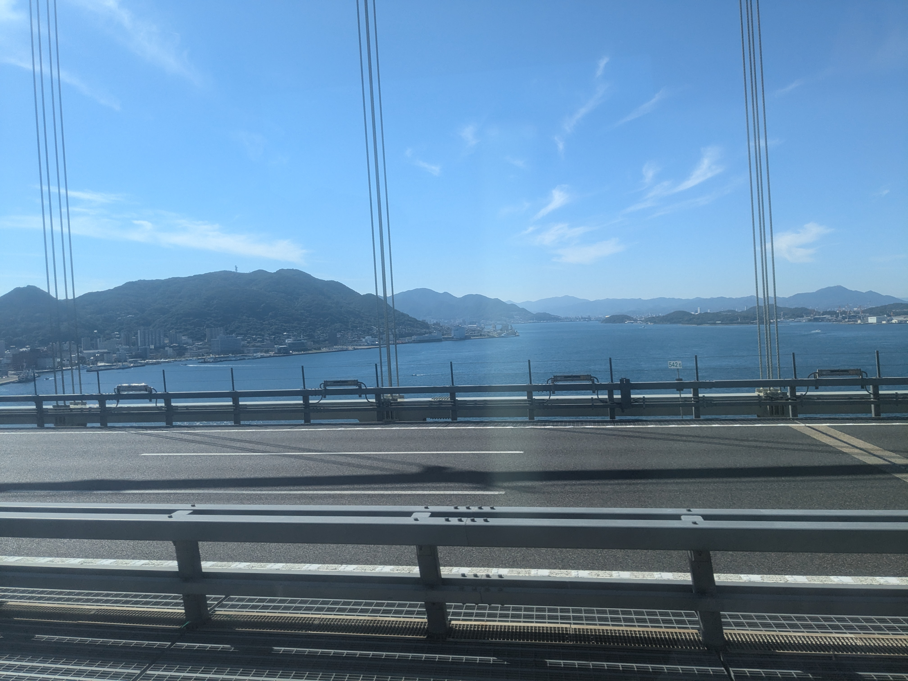

    関門橋からの景色。右奥が皿倉山？関門橋ってこんな向きなんだ。

関門橋を越えたらすぐに都市高速に入って小倉中心部を目指す。小倉駅で1時間25分遅れ。時間が厳しいので九州号を1時間後に変更して、博多BTまで行こうとしていたのを西鉄天神高速BTまでにして昼食時間を確保する。九州島内に入れば以前にも高速バスで見た景色だ。天神北のウエストが外まで並んでいて驚いたが天神の方は空いていたのでセーフ。丸天とごぼう天をいただく。うどんは柔らかくて讃岐うどんに慣れたものとしては信じられない気分になるけれど、出汁は美味しいし、なんといっても練り物の天ぷらをうどんと食べられるのはよい文化だと思う。

九州号 西鉄天神高速BT - 大波止
=============================================

西鉄天神高速BTもどこから上がったものかよく分かっていなかったが、三越のESCを上がるのが速そうだ。

九州号は3連休だからかよく乗っていて、当日では通路側しか取れなかった。しかし長崎まで2900円というのは破格だな [#]_ 。JRだと武雄温泉で乗り換えがあるわけで、これくらいの距離であれば高速バスは便利だろうなと思う。

というか冷房が弱い。東南アジアはどこも冷房をガンガンに効かせていて寒いくらいなのだけど九州は東京よりも東南アジアっぽい気がしているのにそうはならないらしい。佐賀県内は単調で少しうたた寝をしてしまったが県境のトンネルくらいで目が覚めた。トンネルを抜ければ大村湾が見えてくる。眼下の街よりも随分高いところに引かれた高速道路から眺める海は美しい。この旅での1つ目のハイライトだ。

出島道路を経由してスムーズに長崎市内へ。九州号は降車時も切符を見せる必要があるらしい。ノンストップ便なら博多か天神のバスターミナルから乗車なわけで、そんな必要はなさそうに思うがなんなんだろう。海沿いを歩きたかったので大波止で降りる。長崎市内の降車地が大波止と長崎駅前なのは少し気になる。せっかくなら出島道路を出てすぐあたりに止まれば新地なども近いだろうに。大波止から長崎駅なんて路線バスでもバス停1つ分だろう。

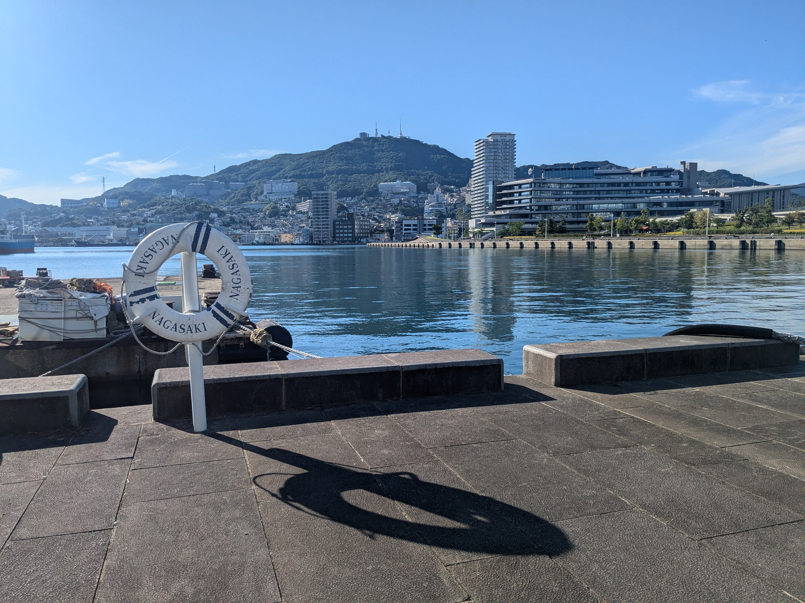

    海沿いから稲佐山を見上げる。あんまり稲佐山からの夜景は好きじゃないけど鉄塔の建った山を見上げるのはどこでも好き。このあと歩いてみて気づいたけどこの浮き輪はこの県庁周りにたくさんあった。

県庁は前に来た時からあったが、ついに新幹線が開通して駅前にはヒルトンとマリオット、少し離れてスタジアムも出来た。長崎市役所も無事建て替わったらしい。長崎というと上場企業がなくなったり、人口減少が深刻だったりと暗いイメージが強いが、新幹線効果か建設投資は順調そうだ。長崎駅前も随分整備が進んでおり、利用に不便はなさそうだ。まあJR駅は随分西に引っ込んだから歩くと遠いのだろうけど、迂回させられたりはもうない。

甘いものがほしくなったのでアミュプラザでカステラの切り落としとスタバでフラペチーノを調達する。アミュプラザのスタバはTea & Cafeらしい。うらやましい。

長崎県営バス 特急 長崎駅前 - 雲仙
=============================================

長崎駅前BTは混んでいるかと思ったが佐世保行きと空港行きに並んでいるだけらしい。おじちゃんが外国人に英語で切符は降りるときに見せるように、と言っていたが、佐世保に帰る米軍関係者なら慣れているからいらない案内かなとも思う。

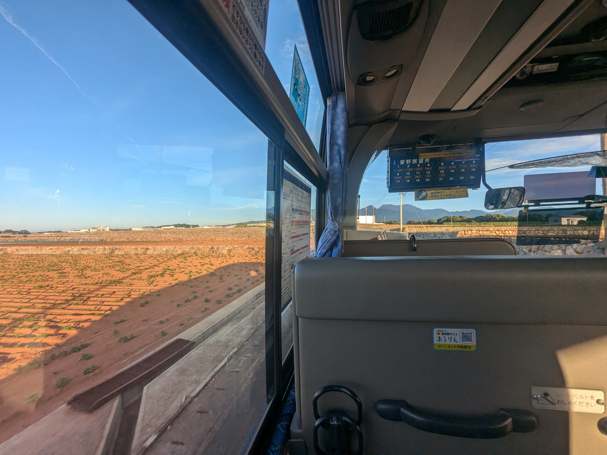

    ジャガイモ畑から雲仙岳を見上げる。

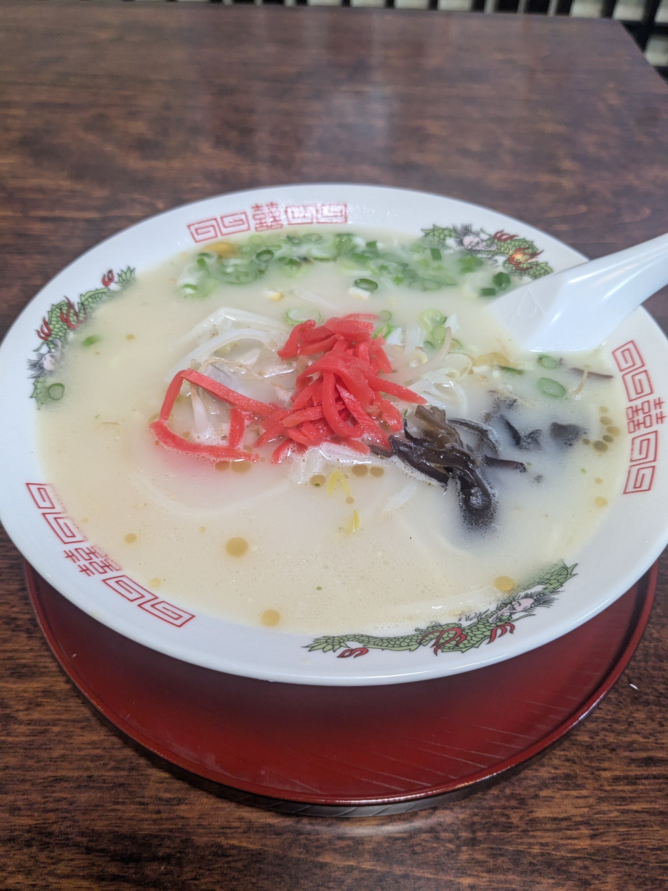

    九州ラーメンなんてこれくらいでいいんだよ。でもちゃんぽん食べておいた方がよかったかもしれない。

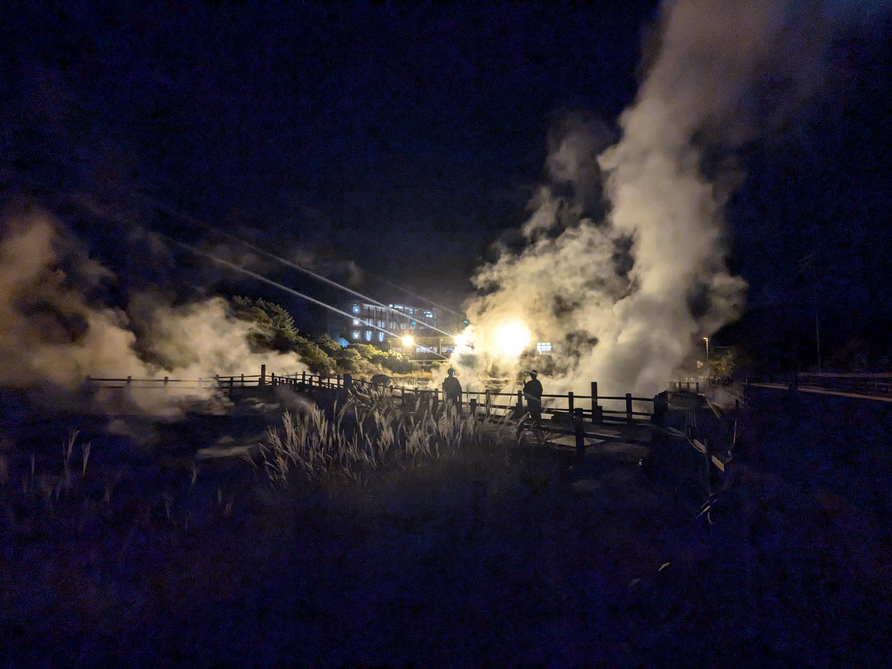

    夜の地獄はライトアップしてるんだね。これとは別に星がよく見えて綺麗だった。

10月13日 雲仙 - 島原 - 熊本 - 別府 - 大分 - 別府
------------------------------------------------------------------------------------------------------------

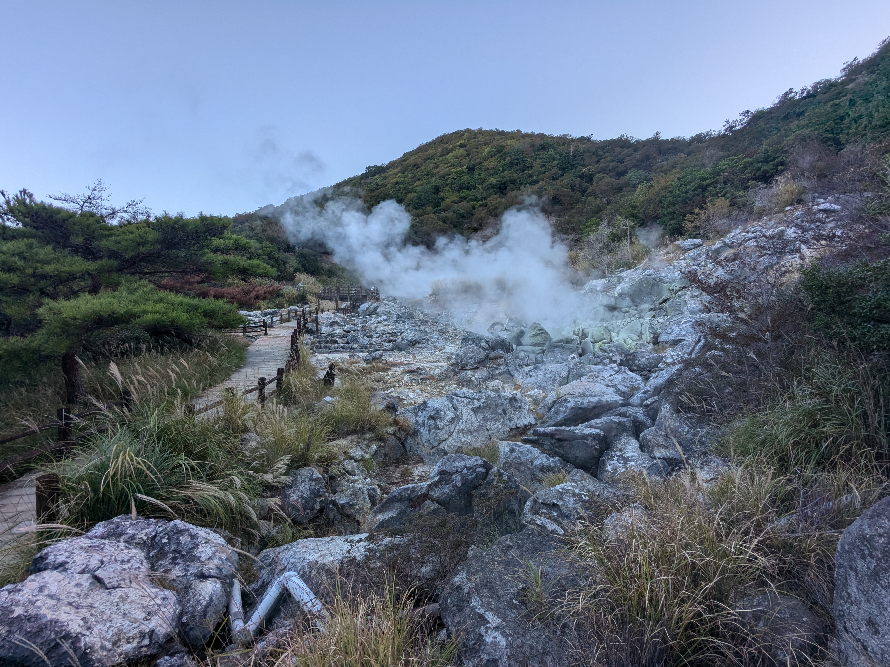

    朝の地獄。カメラ持ち出して猫撮ればよかった。

.. figure:: ./2024年10月11日-14日_北部九州/PXL_20241012_222535104.jpg

    雲仙観光ホテル。今回は縁がなかったけどいつか、ね。

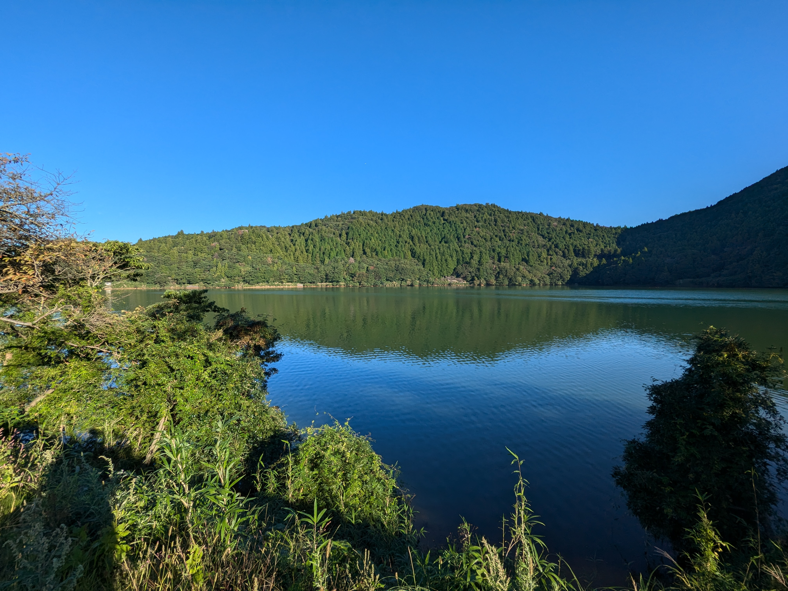

    山と池、青い空。最高です。

島鉄バス 雲仙 - 島原港
============================

熊本フェリー 島原港 - 熊本新港
=============================================

産興バス 熊本新港 - 熊本駅前
=============================================

九州横断バス 熊本駅前 - 別府駅前本町
=============================================

.. figure:: ./2024年10月11日-14日_北部九州/PXL_20241013_053434201.jpg

    阿蘇は大渋滞。でもこんなものは序の口でした。

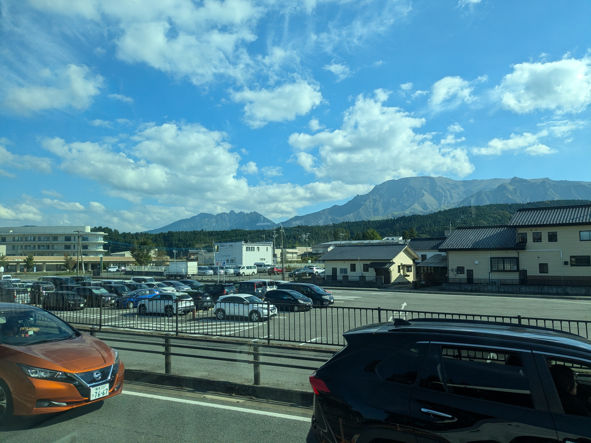

    阿蘇五岳は美しい。でもなんでそれぞれこんなに違うんだろう。

.. figure:: ./2024年10月11日-14日_北部九州/PXL_20241013_055447112.jpg

    外輪山ドライブしてえ～～。渋滞していないときに。

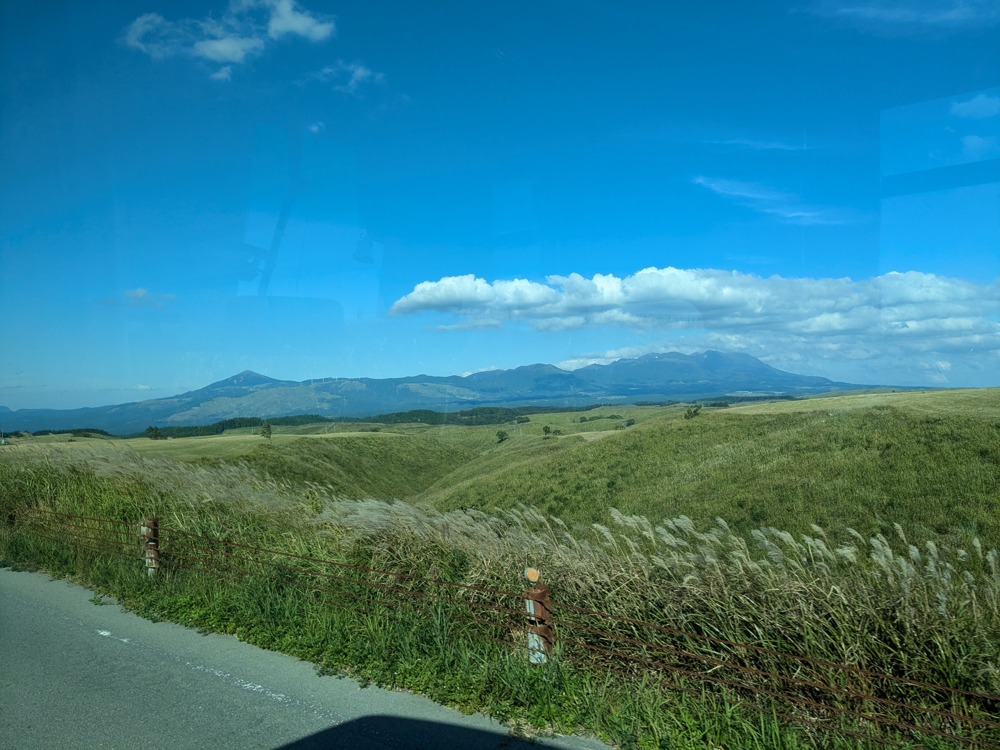

    外輪山からくじゅう連山を望む。鉄道は谷底を走っているから気づかないけれど、九州の高原は広い。

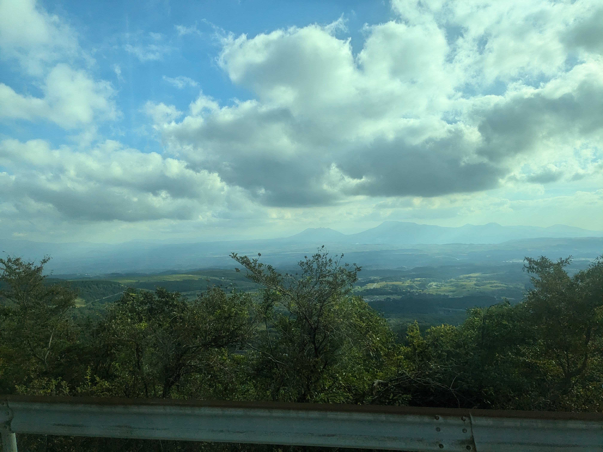

    くじゅうから阿蘇を振り返る。

.. figure:: ./2024年10月11日-14日_北部九州/PXL_20241013_075613816.jpg

    由布院BCでの休憩で由布岳を見上げる。この時はこのバス旅も終わりに近づいている……と思っていた。

日豊線 別府 - 大分
==============================================

大分交通 中央通り - 別府タワー前
==============================================

10月14日 別府 - 大分 - 筑紫野 - 福岡 - 宗像 - 折尾 - 小倉 - KKJ - HND
--------------------------------------------------------------------------------------

大分交通 別府タワー前 - 大分新川
==============================================

SNSとよのくに 大分新川 - 高速基山
==============================================

高速ひた 高速基山 - 筑紫野（二日市温泉入口）
==============================================

大宰府
===========================

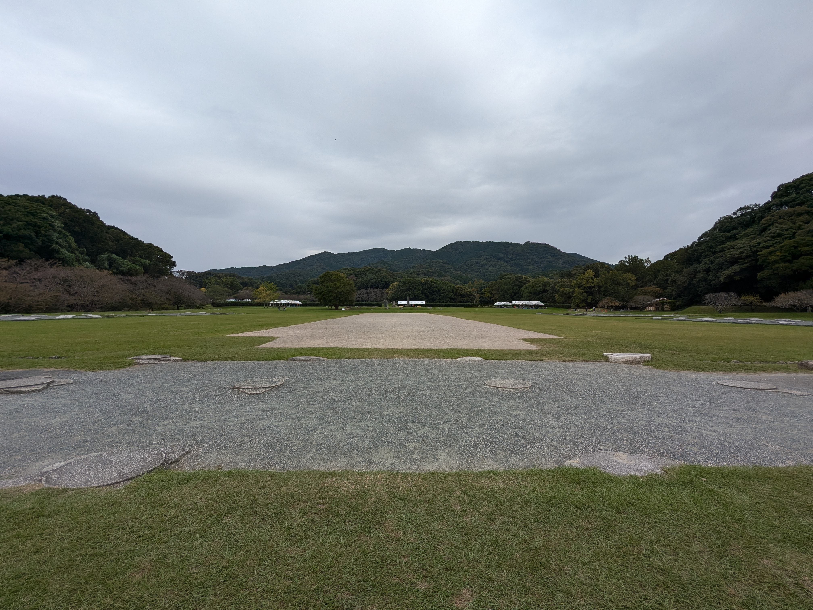

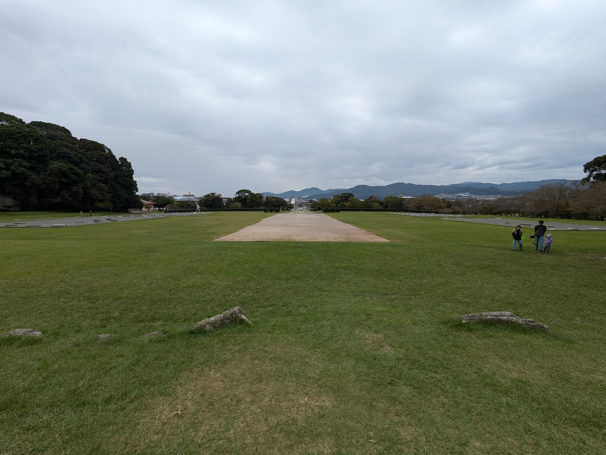

    大宰府政庁跡。シンプルにこういう芝生は好き。めっちゃバッタが飛んでたけど。

.. figure:: ./2024年10月11日-14日_北部九州/PXL_20241014_012119695.jpg

    日本経済大学ってこんなところにあるんだ。でっか。

西鉄バス400系統 君畑 - 博多駅新三井ビル前
==============================================

西鉄バス312系統 博多BT - 愛宕神社入口
==============================================

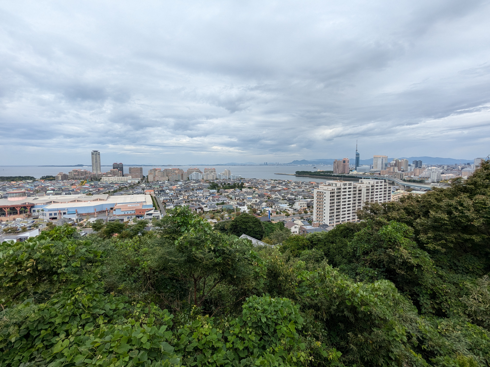

    68mと聞くと小さな丘だと思ったが、見晴らしは随分にいい。しかしこの随分メリハリの利いた都市計画はなんなんだろう。

.. figure:: ./2024年10月11日-14日_北部九州/PXL_20241014_033521629.jpg

西鉄バス300系統 愛宕神社入口 - 中央市民プール
==============================================

西鉄バス68系統 中央市民プール - 港郵便局前
==============================================

.. figure:: ./2024年10月11日-14日_北部九州/PXL_20241014_041847812.jpg

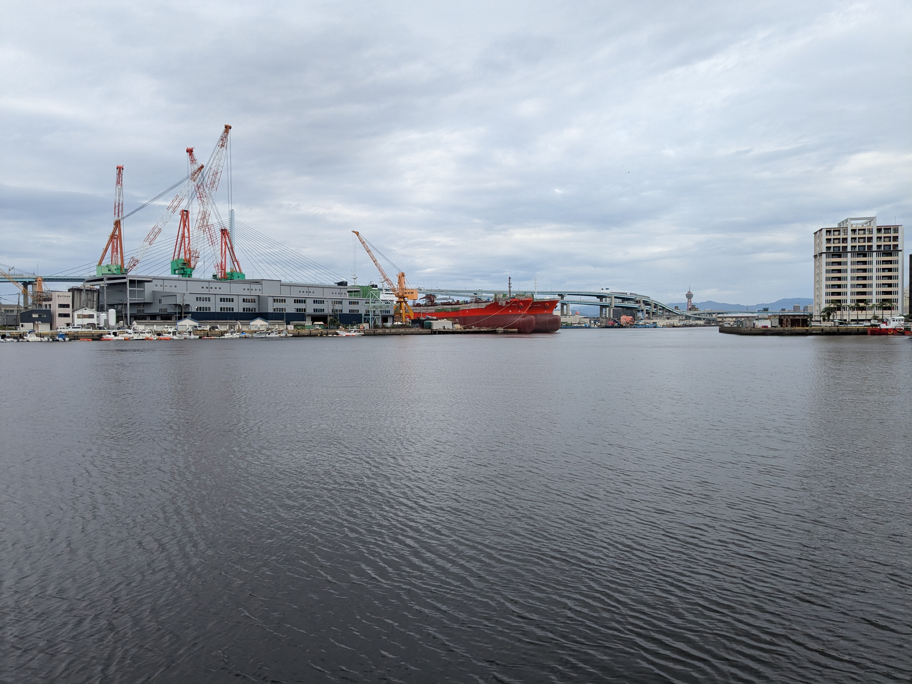

赤間急行 天神日銀前 - 森林都市（バイパス）
===============================================

西鉄バス8系統 自由ヶ丘一丁目 - 赤間駅南口
================================================

鹿児島本線区間快速 赤間 - 折尾
================================================

福北ゆたか線 折尾 - 二島
================================================

北九州市交通局10系統 二島駅前 - 北九州市役所前
================================================

小倉
====================

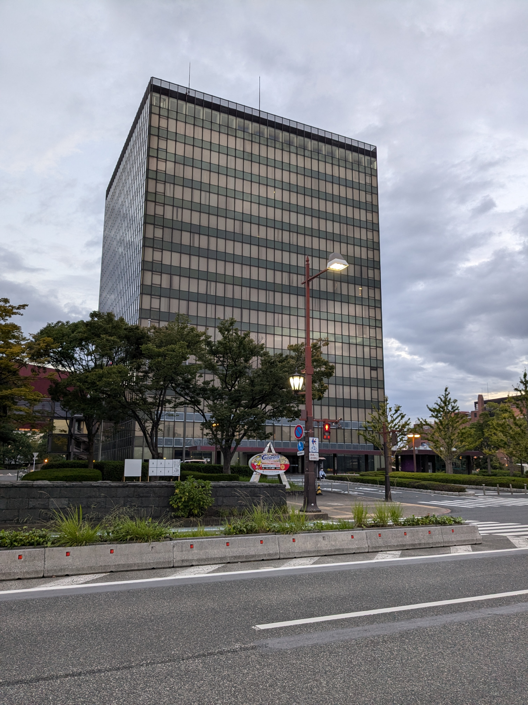

    北九州市役所を見上げる。随分インターナショナルスタイルを体現していて大好きなのだが、別に建築家作品ではなかった記憶がある。

.. figure:: ./2024年10月11日-14日_北部九州/PXL_20241014_084940851.jpg

    旦過市場を後ろから眺める。奥をモノレールが通り過ぎるまで待った方がよかっただろうか。

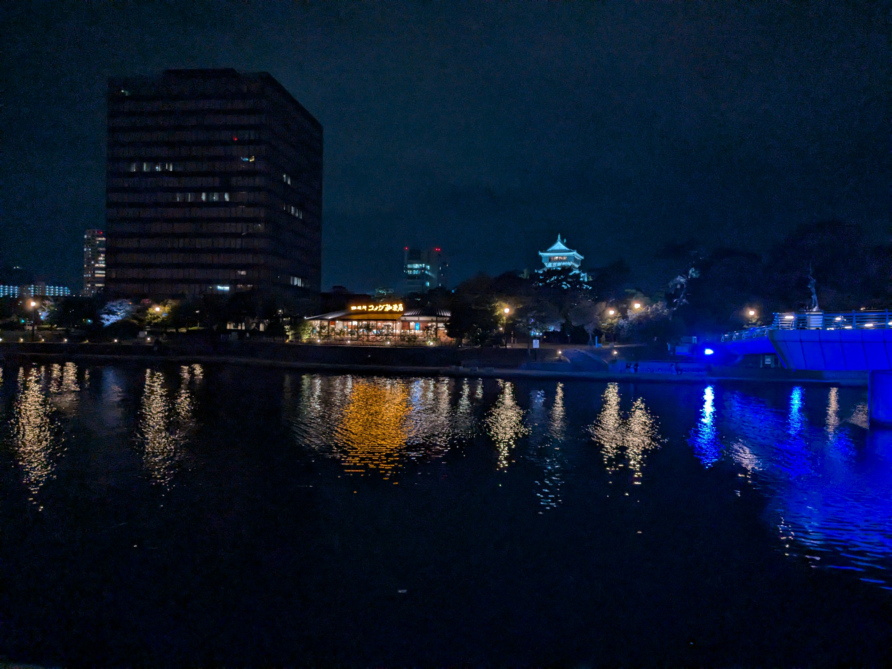

    闇夜に浮かぶ小倉城とコメダ。どうしてこんなにスタバが約束された場所にコメダが出来てしまったのか。経緯が気になる。

.. figure:: ./2024年10月11日-14日_北部九州/PXL_20241014_095202190.jpg

    九州と言えば銀天街。その由来は解決したので、今度は北海道の十字街の由来が知りたい。

西鉄高速バス 砂津 - 北九州空港
================================================

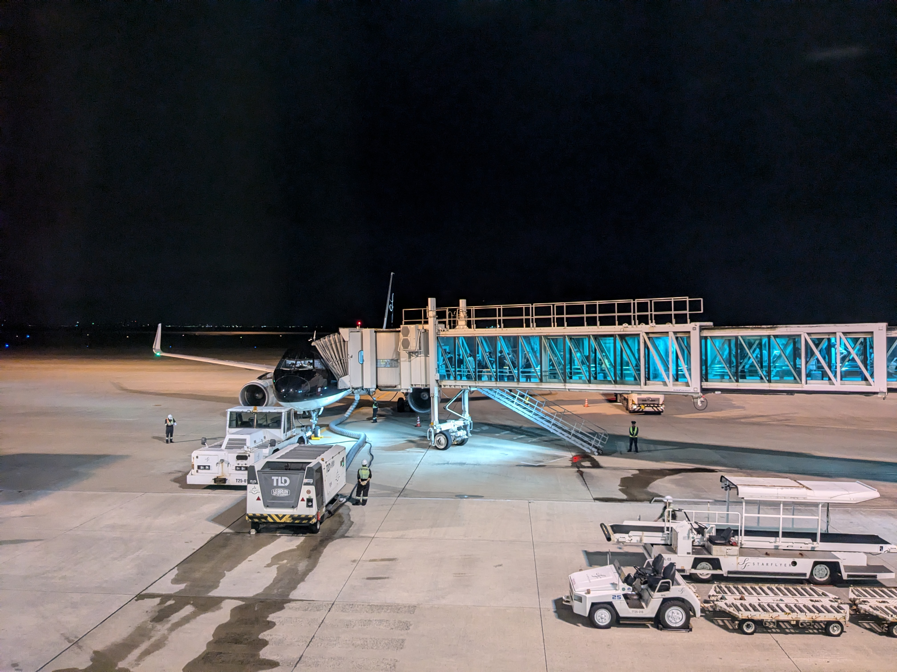

    搭乗機が撮りやすくて助かる。急かされてゲートを通過してもどうせ通路並んでて待たされるの好きじゃない。

.. rubric:: 脚注

.. [#] 速いほど高くなるのが特急料金というものだけど、オタクにとっては長い時間乗れることが大事、だと思う。もちろん停車時間が長くても仕方ないのだけど。
.. [#] 三連休で地元に帰るんだろうと想像する。旅行でお洒落するというのはお出かけの延長として一般的なのだろうけど、夜行列車や夜行フェリーで何晩も過ごす「旅」に慣れたこちらから見るとどうしても不思議だ。
.. [#] 深夜バスとは終バス後に普段の2倍の値段で走る普通の路線バスや、終電後に走る深夜急行バス、という認識であり、夜行バスは夜行バスだと思う。
.. [#] JR九州の企画きっぷも破格なのでさほど差があるわけではない。なんであんなに安くてやっていけるんだろう。
