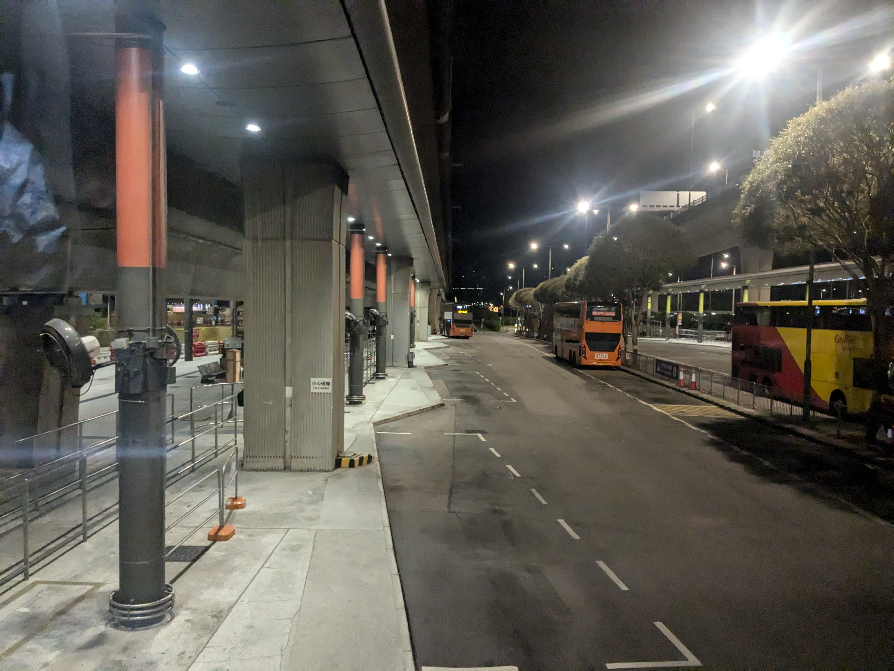
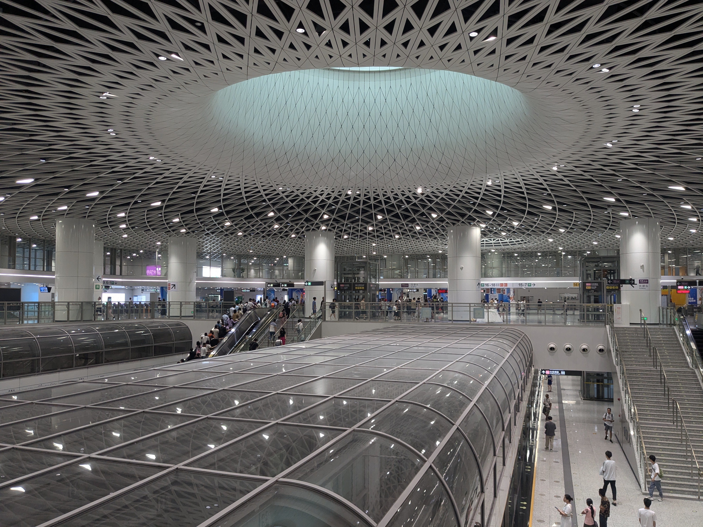

8月10日_東京-香港-深圳-惠州
##################################

8月9日
------

- 2024-08-09 22:08:07	パスポートとカードとスマホ、これさえあればなんとかなる
- 2024-08-09 22:58:00	日本の出入国楽すぎてこの時だけは日本人でよかったなと思える
- 2024-08-09 22:58:34	まあ代わりに香港で自動化ゲートを使えないディスアドがあるのでトントン
- 2024-08-09 22:58:57	イギリスの自動化ゲート通れるの神of神だったから全世界イギリスになれ
- 2024-08-09 22:59:51	搭乗口どうせ左の一番奥なんだろ？俺は詳しいんだって思ったら左だったけど突き当たりくらいで済んでた
- 2024-08-09 23:06:36	hkexpressアプリで乗れるのめっちゃいいな、というか国内線は保安検査場でかざして紙出てくるけど国際線はないのね。ペーパーレス助かる
- 2024-08-09 23:07:07	さすがに2時間前は早すぎたか
- 2024-08-09 23:13:35	esimもインストールしたからあとは使えることを願うだけや
- 2024-08-09 23:17:35	皇岗口岸通ろうかと思ってたけど、バスが動いてるなら福田口岸でいいかな
- 2024-08-09 23:18:16	皇岗口岸は工事中でATMあるか分かんねえ
- 2024-08-09 23:19:14	まあまかり間違って福田口岸開く前に着いちゃったら皇岗口岸行くけど
- 2024-08-09 23:50:37	呼び出しくらったんだけどなんでwwwww
- 2024-08-09 23:52:51	パスポートチェックかなるほど
- 2024-08-09 23:55:33	なんか前の人香港からソウルへ梯子しようとしててウケる、香港にトランジットビザはいらん
- 2024-08-09 23:58:33	結局このタイミングで航空券出てくるのね

羽田を01:10に出るUO623便 [#]_ で9日間しかないお盆休みをフルに活用することにする。時間が遅いので研究室の飲み会に参加しても問題ない……酒を飲んで夜行バスに乗り遅れた経験 [#]_ を反省してアルコールは固辞して宴会半ばで帰る必要はあったが……。

家でシャワーを浴びて予定より早い時間の電車に乗る。少し余裕を持って退散しすぎたらしい。

行きの電車でオンラインチェックインを済ませる。最後の最後で「スマホの方はアプリでオンラインチェックインするように」という注意書きを眺めながらボタンをクリックしてしまいミスったなと思って、一応アプリをインストールしてみたところ無事にアプリにもオンラインチェックインの内容が反映されており搭乗券をアプリで表示することが出来た。

オンラインチェックインでも国内線だと保安検査場で紙 [#]_ が出てくるが、国際線はそれもなく完全にペーパーレスで飛行機に乗れる……のかとワクワクしていたら搭乗口で呼び出されてパスポートと手荷物の確認をされて、そこで実チケットが出てきた。手荷物の大きさは気にしないらしい。1日を終えてスマホの電池が危なかったので充電しながら待つ。少し早く着きすぎたらしくコンセントは空いていた。

UO623 HND-HKG
-------------

- 2024-08-10 00:04:40	せめて中国evisaにならんかなー
- 2024-08-10 00:39:50	香港人ばっかや、これが円安
- 2024-08-10 00:43:46	明日は短いとはいえ搭乗時間も僅かなのでさっさと寝ましょうかね
- 2024-08-10 00:55:27	霧出てきた、これがhkexpよ

お盆初日にもかかわらず周りは相当数が香港人と見える。円安のせいだろうか？ [#]_ 日本は2015年頃から観光客輸出国から受入国へと変わっているが、ますます訪日観光客ばかりが目立って日本人は海外旅行に行けない国になっていくのだろうか。 [#]_

.. figure:: ./img/PXL_20240809_153657792.jpg

    一応今から乗ります風の写真として。注意書きの繫体字が香港行きであることを物語ってくれる、たぶん。

香港
----
- 2024-08-10 05:02:49	着陸
- 2024-08-10 05:07:32	まあまあ早着
- 2024-08-10 05:10:38	めっちゃお腹空いた
- 2024-08-10 05:33:20	入境完了

香港に到着、と言っても2023年のGWにも来たからあまり感慨はない。全速力で入管に向かったためか列が短くすんなり入境出来たBaggage ClaimのATMで現金を下ろす。人民幣も下ろせると書いてあったがその選択画面は無いように思えた。人民元建て口座のキャッシュカード向けサービスなのかもしれない。早速バスで空港を脱出するが、その前にはまず八達通 [#]_ にチャージする必要がある。手持ちの八達通はほとんど残高がマイナスだった [#]_ ので1回も使ったことのなかった互通行 [#]_ にチャージすることにする。機場快綫の運行時間前なので駅の充值機はまだ使えないらしい。どうしたものかと思ったが、八達通はコンビニでチャージ出来るのを思い出した。コンビニでチャージするだけして何も買わない迷惑な客になってしまったが、めぼしい物を置いてないコンビニが悪い。

A36 機場（地面運輸中心）巴士總站-元朗同樂街
================================================
- 2024-08-10 05:59:15	爆速で進みすぎてバスの始発間に合った
- 2024-08-10 06:02:02	持ってきた八達通は軒並みチャージ額マイナスだったので一度も使ったことない互通行を使うことに
- 2024-08-10 06:03:23	中国国内の交通系IC事情あんまり理解してなくて、交通联合で相互利用出来るはずだけど、交通联合のマークが付いてないカードでも相互利用できるのか分からん
- 2024-08-10 06:03:45	香港くそあちいっす
- 2024-08-10 06:04:49	元朗で飯食えるなら食ってこう

そんなわけでバスターミナルにたどり着いたもののまだ始発のバスが来ないらしい [#]_ 。空港をスムーズに出てこれたのはよかったが、少し順調過ぎたようだ。日の出前だというのに香港は信じられないほど蒸し暑い。中国が日本より暑いということはないのだが、普段昼間は空調の効いたオフィスにずっといるので、突然夏の屋外で観光をすることへの不安を感じざるを得ない。うちわで扇ぎながらバスを待つ。

    無事にバスの2階最前列を確保する。香港のバスはほとんど2階建てで、ロンドンよりもその比率は高いと思う。香港は南の方にあって子午線よりも西に位置しているから、夏の6時が近づいてもまだ暗い。

屯門赤鱲角隧道は2020年末に開通したので通るのは初めてだ。港珠澳大桥と合わせて珠江西岸と東岸の行き来に使えるというが、2回も国境を越えるのはさすがに面倒であまり使われているとは思えない。しかし以前は海を挟んでいた赤鱲角と新界西部が飛躍的に近づいたのは重要だろう。

元朗で朝ごはんにする。米線の店と盒飯の店でしばらく悩むが米線に決める。薦められるままに肉類4種盛りの米線を選ぶ。52元。物価は新界でも九龍と変わらなさそうだ。付け合わせを油菜にしたら青菜が出てきた。香港料理は薄味で関東人には少々評価に困るときがある [#]_ と思っているが、これはちゃんと塩味が効いており出汁が美味しい。潮州料理らしいから香港から少しでも北に行けばちゃんと塩味が効いているのだろうか？

.. figure:: ./img/PXL_20240809_221051458.jpg

.. figure:: ./img/PXL_20240809_221940574.jpg

B1 元朗同樂街-落馬洲站總站
==============================
- 2024-08-10 07:47:06	B1はほんと混んでるよなあ

落馬洲/福田口岸に向かうB1系統に乗る。このバスは国境地帯の山に行くにも使うので結構慣れている、というか去年香港に来た時にも乗った。元朗を出るとヤードなどの殺風景な風景が続き、香港らしい裕福な都会の雰囲気は消えて内地っぽさが深まる。向こうに見えてくるのは深圳のビル街なのだけど。ついにこのあたりも開発が決まったので香港側に農村が広がり、中国側に高層ビルが聳え立つアンバランスな景色も変わってしまうだろうか。

落馬洲/福田口岸
----------------
- 2024-08-10 08:51:15	中国だあ、になっとる
- 2024-08-10 08:51:51	入境はわりかしいろいろ聞かれたな

口岸というのは英語だとPortにあたり、日本語だと国境検問所、だろうか？香港と内地 [#]_ の間の陸路国境を渡るための施設である。香港は中国（中華人民共和国）だけど中国（内地）ではない、一国二制度 [#]_ を採用しているのでその間に国境 [#]_ が設けられている。現在香港と内地の間には西から順に8つの陸路国境 [#]_ が設けられているが、落馬洲/福田口岸は深圳側は新都心である福田に直結し、香港側は鉄道駅のある2つの口岸の1つということで人気がある。

バスターミナルは結構賑わっている。日本人にとっては越えづらくなってしまった国境だが香港・内地居民にとっては人によっては毎日通過する何でもない施設なのだろう。6年前には私にとっても。

6年前に初めて香港から深圳に入った時もここだった。だから今回も、というつもりは無かったのだが、利便性からつい自然と選んでしまうらしい。

香港の出境はいつも通り何も聞かれない。そのまま深圳河を歩いて渡る。中国側の外国人レーンは空いている。そういや深圳はアライバルビザで入境できるはずだがその案内は確認し忘れたな。中国も入国カードを書く必要があると思ったが見当たらない。窓口まで進んだら紙を渡されたので素直に埋める。以前は何も聞かれなかったと記憶しており、ビザが下りてるのだからあっさり終わるかと思ったら滞在日数、中国は初めてか、旅行の目的は、などと一通り聞かれてしまった。英語だからよいが少し面食らう。

そんなこともあったものの無事に内地入境。実に5年ぶりの内地である。続いて通過する中國海關（税関）のエンブレムと手荷物検査の長蛇の列に内地を感じる。

早速ATMで現金を下ろすが少し下ろしすぎてしまった。当初は支付宝が問題なく使えるか分からなかったから仕方ないとして、途中でもう一度引き出すタイミングはいくらでもあったから最初から全部下ろす必要は間違いなくなかった。

.. figure:: ./img/PXL_20240809_234253494.jpg

  6年前も撮った記憶があったので写真を。その時は気づかなったが見比べたら少し変わっていた。

深圳 10，14，16号线 福田口岸-岗厦北-大运-回龙埔
------------------------------------------------------------
- 2024-08-10 09:14:45	老いも若きもスマホ見ててこれが低头族かっつってる
- 2024-08-10 09:25:14	中国人軽装だよね
- 2024-08-10 09:25:46	女性は鞄の一つくらい持ってるけど、男性は昼休みにランチにでも行くような感じでスマホだけ持って地下鉄乗ってる

待望の内地だが路線バスで惠州に行って火车に乗る計画なので早めに先に進んでおきたい。さっさと地下鉄に乗ってバスの始発駅まで向かう。途中で乗り換えた岗厦北の駅は実に立派だった。

惠州 208路 龙岗汽车总站-火车站
------------------------------------
- 2024-08-10 10:00:34	深圳ではどこにも交通系ICチャージする手段がなくて終わったかと思ってたら支付宝で公交乗れそうでget事なき
- 2024-08-10 10:09:22	aitoってHuawei系の車なんだ
- 2024-08-10 13:13:01	やることなくなったし候车室来ちゃった
- 2024-08-10 13:13:20	結局Alipayでバス支払えなかった気がする、ごめんて

汽车总站というからバスターミナルかと思っていたのだがよく地図を見ると自動車に関するお店が集まっているように見える。遠目には建物の裏に乗降バースのような空間も見えたので真相は分からない。実際地下鉄駅を出てもバスターミナル前という印象はない。まだ中国の都市構造を理解していないので適当な駅前で適当な店を見つけるのは難しい。

仕方ないので一息つく間もなくバスに乗る。一度交通联合のカードでタッチするも残高が足りなさそうだったので支付宝の公交卡を使ってみる。運転手に何か言われたが分からない。たぶんさっきもタッチしただろみたいなことなんだと思うが……。始発駅では空いており無事にオタク席 [#]_ を確保したが続くいくつかのバス停で満席、というかギュウギュウ詰めになってしまった。みんなどこまで行くんだろう。まさか惠州中心部まで3時間乗るわけはないだろうが……。

惠州は东江の畔にある市で、珠三角、もしくは粤港澳大湾区の一角を形成しているがその中では少し見劣りする程度の街である。特に見どころも知らない。私も惠州に用があるわけではなくて、张家界に向かう列車の始発駅があるから、である。中国鉄路は慢性的な座席不足対策として、まず始発駅に座席の大半を割り当て、余った分が順次途中駅に割り振られる形になっている。

しかも深圳から惠州に向かう3時間以上の長距離路線バスがあるとなればそれだけでも行く価値はあるだろう。日本でもめっきり減った長距離路線バスであるが、中国でもさほど多いわけではない。路線バスは基本的に各市 [#]_ ごとの独立運行になっているため市を跨いだ路線は相当少なく、この路線も深圳市内まで伸びてはいるが惠州市の路線バスということになっている。また近年は郊外まで地下鉄が延びており、バスは市内交通の主役からフィーダー輸送へと性格を変えている。

K685 惠州-张家界西
------------------------
- 2024-08-10 13:14:35	人生、ですかねえ……
- 2024-08-10 13:21:21	階段上がって右左って配置はまあどの駅も割と似てる
- 2024-08-10 13:26:27	高鉄駅はもっと綺麗だよ！！！
- 2024-08-10 13:29:07	人生とは卧铺车
- 2024-08-10 13:51:43	なんか南行きの列車が死ぬほど遅れてるらしいわね
- 2024-08-10 15:04:47	ようやくここに帰ってこれた
- 2024-08-10 17:56:41	ねむすぎてねる
- 2024-08-11 05:38:01	中国の鉄道なくなったもの- 切符と换票 おかげさまで乗り方が分からん、でも到着30分前に起こしてくれるのは健在なので助かる- BGMとCM 高鉄には元々無かったからそれに合わせてなくしたのかも、静かになったのはいいけどBGM無いのはちょっと寂しい

.. figure:: ./img/PXL_20240810_060234577.jpg

.. figure:: ./img/PXL_20240810_041407376.jpg

.. figure:: ./img/PXL_20240810_055855788.jpg

.. rubric:: 脚注

.. [#] 冬ダイヤは23:50発なので出発日の日付には注意を要する。
.. [#] スキーに行く前日にZoom飲みでスパークリングワインとシードルを空けてたら夜行バスに乗り遅れた。その時は翌日の始発の新幹線に乗ることでなんとかしたが、さすがにもう繰り返したくない。
.. [#] あれ何？いらないんだけど。知ってる人がいたら教えて。
.. [#] 2023年の香港からの訪日観光客数が211万人、日本からの訪港旅客数が34万人なので、円高円安に関わらず圧倒的に香港人が多い。韓台中はレベルが違うとしても、訪日観光客数において香港はたった一都市でその次に付けており、人口750万人の4分の1弱が日本に来ている計算になる。
.. [#] 訪日観光客が多い限り航空路線は維持されるだろうし、海外まで行って日本人観光客に揉まれるよりはいいのかもしれない。
.. [#] 香港版Suica。日本ではオクトパスカードと呼ばれることが多い。表記を八達通に統一したのは気分。
.. [#] 八達通は100元までは残高がマイナスになっても改札を出れるし、バスに乗れる。デポジットが50元なのでそれ以上のマイナスになるように乗れば少し得することになる。機場快綫が100-110元なのでうまく調整するとよい。
.. [#] 香港の八達通と深圳の深圳通が1枚のカードに乗っている。便利そうなので買ってみたが前回は他の八達通を使っていたので一度も使わないままだった。
.. [#] 香港のバスがいくら終夜運転しているとはいえ、よっぽどの路線でなければ本数は多くない。夜明け前には1時間間隔くらいになってしまう。
.. [#] 薄味の中の素材の風味を楽しむものと思えばよいのだが、少なくとも日本の中華料理のイメージとはかけ離れており、あまり人にはおすすめできない。日本の中華料理は陳建民（四川料理）の功績が大きく、他には上海や東北の色が濃いと思われる。点心、雲吞、焼売、腸粉、あたりが広東料理の代表例だろうか。
.. [#] 香港、澳門、台湾と対比して中国共産党が統治する領域を公式に「内地」と呼んでいる。
.. [#] 中国語では一国两制。2019年の反送中運動以降北京政府の統制が強まっており、言論の自由や普通選挙などが脅かされていることはご存じのことと思うが、一国二制度のうち港人治港が爱国人治港に変わっただけで依然としてほとんどの領域で一国二制度の枠組みが残っている。使用言語も北京語の存在感が強まっているとはいえ広東語が優先される現状は、北京語が優先される内地とは異なるし、国境にボーダーコントロールが置かれているのも、香港にはビザなし渡航出来ても内地には出来ないのも国境管理に関する権利を香港特別行政区が手放していないから、と言えるだろう。
.. [#] "国"境ではないので当局は邊境とか邊界とか呼んでいるが、便宜的に国境と呼ぶ。出入国は出入境に言い換えられる。
.. [#] 港珠澳大桥/港珠澳大橋，深圳湾/深圳灣，福田/落馬洲支線，皇岗/落馬洲，罗湖/羅湖，文锦渡/文錦渡，莲塘/香園圍，沙头角/沙頭角。他には高铁/高鐵と高速船、空港がある。
.. [#] 中国のバスの前タイヤ上は大抵3人がけのロングシートになっているので日本のオタク席とは少し異なる。
.. [#] 中国の市は省の下に置かれる行政区分であり、県が市の中に置かれている。省がバカでかいことと、省の中の市はさほど大きくないことを合わせると、おおよそ中国の市が日本の県にあたると考えてよいだろう。ただし中国の市の中心部には区が置かれているので東京都のようなものだろうか。もっと詳しく中国の行政単位に言及するなら、都市化が進んで県が市に変わった県級市があったり（元の市は地級市と言う）、そもそも北京上海天津重慶は省と同格の直轄市だったり、県のさらに下の行政単位である街道、郷、鎮、民族自治区に目を移せば（省級自治区から郷鎮レベルまで様々）旗や建設兵団など多種多様な自治区分が、広大で多様な国土を覆っているが、普通に過ごす分には市未満の行政区分が顔を出すことはほぼないだろう。
