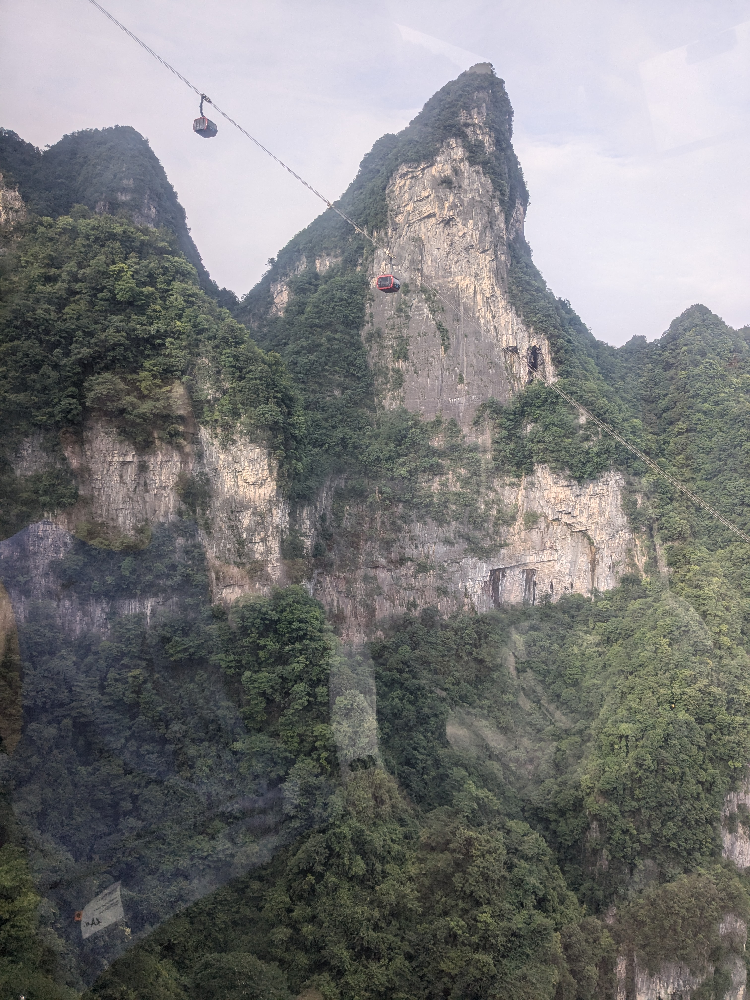
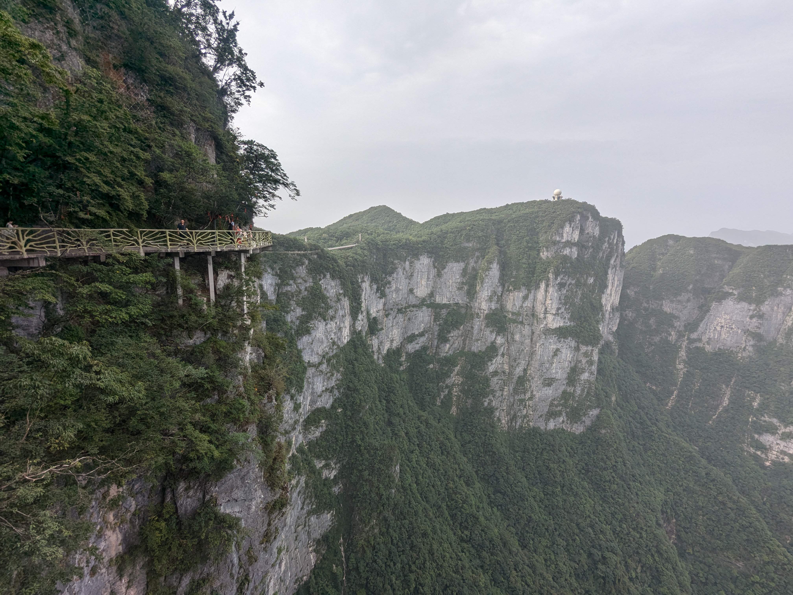
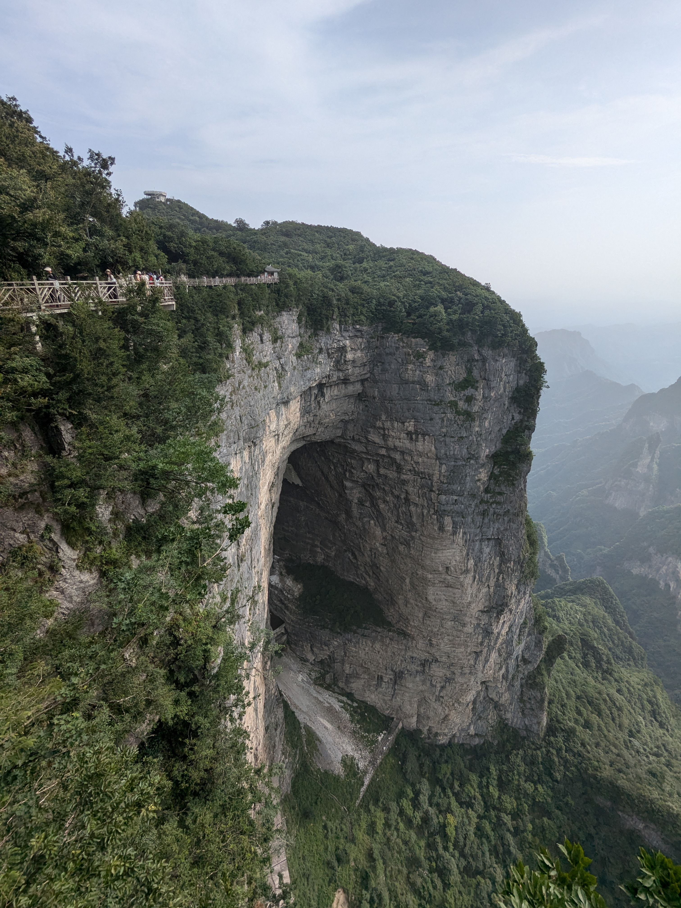
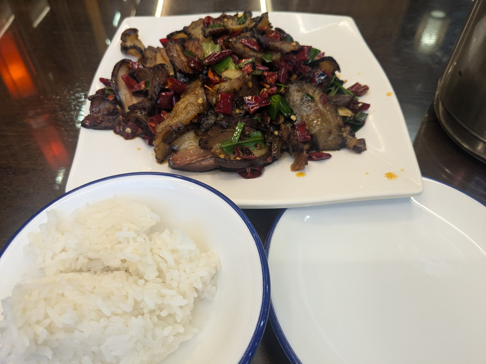

8月11日_张家界-凤凰-怀化
##############################

张家界
------

17路 高铁站-武陵山珍馆
==========================
- 2024-08-11 06:16:35	人工通道でパスポートかざすのが正解なのかな
- 2024-08-11 06:17:45	切符も確保できた
- 2024-08-11 06:18:15	問題は携帯の充電だけど、宿取ったのでそこで充電出来るはず
- 2024-08-11 06:18:48	快速だと18人に1つしかコンセント無いの忘れてたわ
- 2024-08-11 06:25:37	あとまあ短いけど高鉄で充電出来るはず
- 2024-08-11 06:28:23	朝飯どうしよう
- 2024-08-11 06:33:25	バス降りたところでなんか食べれるといいな
- 2024-08-11 06:41:37	扫码失败するんで交通联合で乗った

.. figure:: ./img/PXL_20240810_232818769.jpg

.. figure:: ./img/PXL_20240810_234347845.jpg

天门山
======
- 2024-08-11 08:29:37	町中にゴンドラが通ってる時点でエモ
- 2024-08-11 08:33:16	川で洗濯してる上を観光客乗せたゴンドラが渡ってくのもよい
- 2024-08-11 08:54:22	標高1100m涼しすぎて神
- 2024-08-11 09:00:20	1430らしい
- 2024-08-11 09:16:55	高所恐怖症の人は堪らんだろうなあ
- 2024-08-11 09:49:20	日本と同じくアブラゼミ、ミンミンゼミ、ツクツクホウシが鳴いている
- 2024-08-11 11:06:13	ここまで下りてきただけで暑いっす

.. figure:: ./img/DSCN1842.JPG

.. figure:: ./img/PXL_20240810_235348477.jpg

.. figure:: ./img/PXL_20240811_000425213.jpg

.. figure:: ./img/PXL_20240811_001631697.jpg

.. figure:: ./img/PXL_20240811_002344436.jpg

.. figure:: ./img/PXL_20240811_002628061.jpg

.. figure:: ./img/PXL_20240811_005524948.jpg

.. figure:: ./img/PXL_20240811_005531524.jpg

.. figure:: ./img/PXL_20240811_011604434.jpg

.. figure:: ./img/PXL_20240811_015422486.jpg

.. figure:: ./img/PXL_20240811_015541228.jpg

.. figure:: ./img/PXL_20240811_020555206.jpg

.. figure:: ./img/PXL_20240811_020758525.jpg

.. figure:: ./img/PXL_20240811_021201004.jpg

.. figure:: ./img/PXL_20240811_022118767.jpg

.. figure:: ./img/PXL_20240811_022517028.jpg

.. figure:: ./img/PXL_20240811_022527747.jpg

张家界市内
==========

.. figure:: ./img/PXL_20240811_035701447.jpg

4路 十字街-高铁站
====================
- 2024-08-11 11:56:52	とりあえず下界に下りてきたけどどうすっかね
- 2024-08-11 11:58:18	早めの列車乗れるなら乗っちゃおうかな
- 2024-08-11 13:10:19	教習車をバスが追い抜かすのおもろい
- 2024-08-11 13:10:49	ちなみに教習車はシュコダだった
- 2024-08-11 13:29:57	直前キャンセルになっちゃったけど早い時間の列車に変更
- 2024-08-11 13:48:52	高鉄にコンセントねえ！w
- 2024-08-11 13:49:20	CRH3のどれかだった
- 2024-08-11 13:51:09	3Cっすね

G6117 张家界西-凤凰古城
------------------------------
- 2024-08-11 14:01:13	https://www.foodtalks.cn/news/44228無糖のお茶が市民権獲得したのこの5年で中国に起きた変化の中で最も好ましいものの一つかもしれない
- 2024-08-11 14:21:34	高鉄空いてるっつったって日本の新幹線より乗ってるよなあと思ってたら2駅目でほぼ満席になってしまった、マジで人民はどこから来てどこへ行くんだ
- 2024-08-11 14:28:47	逆に長距離バスを駆逐しそうな勢いらしいね
- 2024-08-11 15:00:15	確かに都市はマンションばっかりだから車持つ環境には見えないわね

凤凰
----

凤凰磁浮线
==========
- 2024-08-11 15:01:07	リニアモーターカーと聞いたら乗らないわけにはいかないよなあ？
- 2024-08-11 15:02:00	支付宝使えるのめっちゃありがたいんすけど、スマホのバッテリーの重要性が爆上がりするのでちょっと困る

.. figure:: ./img/PXL_20240811_061101736.jpg

凤凰古城 白天
=============
- 2024-08-11 16:46:21	【悲報】mstdn.beer金盾に引っかかる
- 2024-08-11 16:47:57	ちなみにmstdn.social，fedibird.comあたりは弾かれないのでFediverseサーバーを無差別にブロックしてるとかじゃなくて何か中国当局の気に障る事があった模様
- 2024-08-11 16:55:55	subwaytooterキャッシュしてる分は表示されるけど、新規は取得出来ないんじゃない？
- 2024-08-11 16:59:14	ローミング？それなら見れる
- 2024-08-11 17:06:29	私も今回は基本マカオsimをローミングして金盾回避してる
- 2024-08-11 17:08:52	でもマストドン使えないと困るから（困らない）別鯖にアカウント作るかなあ
- 2024-08-11 17:10:42	ついに自鯖かあ
- 2024-08-11 17:20:59	自鯖持ちの怖い人達に囲まれてる

.. figure:: ./img/DSCN1883.JPG

.. figure:: ./img/DSCN1843.JPG

.. figure:: ./img/DSCN1844.JPG

.. figure:: ./img/DSCN1846.JPG

.. figure:: ./img/DSCN1847.JPG

.. figure:: ./img/DSCN1850.JPG

.. figure:: ./img/DSCN1855.JPG

.. figure:: ./img/DSCN1860.JPG

.. figure:: ./img/DSCN1863.JPG

.. figure:: ./img/DSCN1869.JPG

.. figure:: ./img/DSCN1876.JPG

.. figure:: ./img/DSCN1878.JPG

凤凰古城 夜里
=============
- 2024-08-11 20:14:15	とりあえず宿に帰ってきた
- 2024-08-11 20:14:23	意外と時間ねえな
- 2024-08-11 20:14:40	この部屋回線の入りにムラがある
- 2024-08-11 20:14:54	シャワー浴びようかなあ
- 2024-08-11 20:42:59	飯食ってウロウロしてバス捕まえて高鉄（素振り）
- 2024-08-11 21:49:23	汗だくになったので結果的にここで浴びても何の意味もなかった
- 2024-08-11 21:55:26	人やばかった

.. figure:: ./img/DSCN1894.JPG

.. figure:: ./img/PXL_20240811_121919935.jpg

.. figure:: ./img/PXL_20240811_123049994.jpg

高铁专线A2路
===============
- 2024-08-11 21:58:06	内地のバス行儀よくてつまんないんだよなと思ってたら、大都市のバスが行儀いいだけだった。一歩出たら期待以上の無法地帯だわ
- 2024-08-11 22:00:09	14億がどこにでも現れる
- 2024-08-11 22:06:24	- ちょっとでも邪魔だったらクラクション鳴らします- バスってこんなに速かったんだと思うレベルで飛ばします- 停車中に動画見始めます- 運転中に電話かけ始めますでもこんなバスにも夜中の道で追い越ししていく一般車がいます

G6421 凤凰古城-怀化南
----------------------------
- 2024-08-11 22:18:19	#中国の駅あるあるデカい
- 2024-08-11 23:03:20	またcrh3cでした

.. figure:: ./img/PXL_20240811_131704551.jpg

K1172 怀化南-重庆北
--------------------------
