8月14日_太原-平遥
######################
太原
----
- 2024-08-13 21:11:34	まずはホテルに行って荷物預かってくれないか交渉だな
- 2024-08-14 05:40:34	花粉が飛んでるらしくて口の中が痒いんだけど、油断してたので抗アレルギー薬持ってきてない

双塔公园
=========
- 2024-08-14 08:00:54	こういう公園って日本だと札幌の中島公園か福岡の大濠公園くらいしか思いつかない

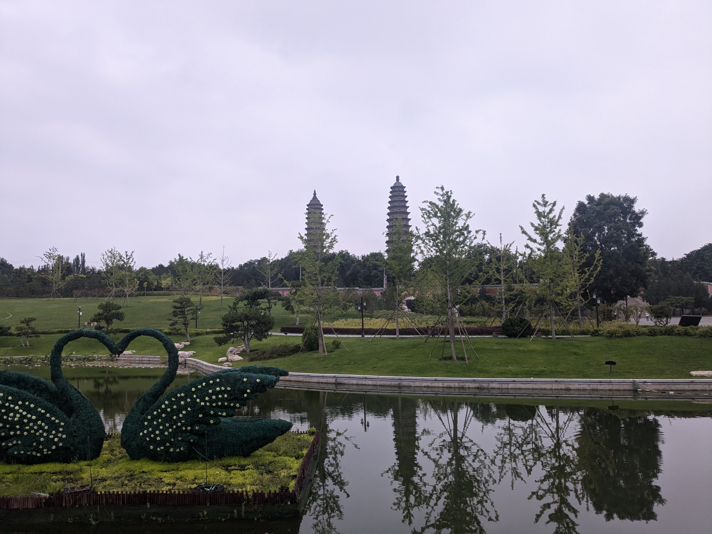

迎泽公园
========

.. figure:: ./img/PXL_20240813_225728313.jpg

2号线 大南门-通达街
=======================

301路 通达西街人民南路口-晋祠公园
======================================
- 2024-08-14 08:55:50	太原ぜんっぜんバス来ない
- 2024-08-14 08:59:29	太原涼しすぎて寒いまである、22.7℃で風がそよそよ吹いています
- 2024-08-14 09:01:08	長三角クソあちいと聞く
- 2024-08-14 09:03:19	曇っていて日差しもない
- 2024-08-14 09:03:34	持ってくるべきはうちわでなく上着だったか

晋祠
====

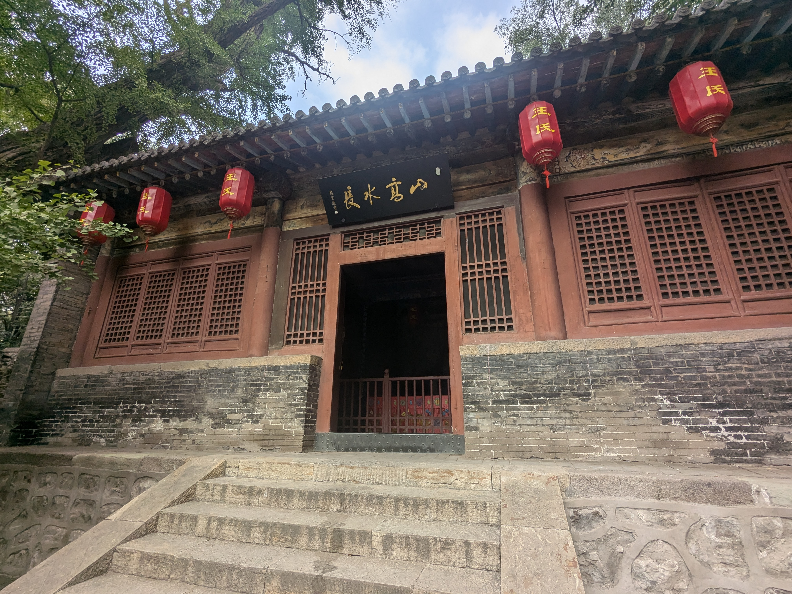

.. figure:: ./img/PXL_20240814_005859234.jpg

.. figure:: ./img/PXL_20240814_011734978.jpg

.. figure:: ./img/PXL_20240814_011848984.jpg

.. figure:: ./img/PXL_20240814_012624748.jpg

856路 晋祠公园-火车站
==========================
- 2024-08-14 11:28:17	疲れたし街に帰ろう
- 2024-08-14 11:31:16	バス来ねえ〜〜
- 2024-08-14 11:31:36	来ないって言ってるのに来ないのも、来るって言ってるのに来ないのも同じくらい嫌い
- 2024-08-14 11:32:35	バスはこだてがバス停について一息ついたら間を置かずに来い
- 2024-08-14 11:35:55	素直に前のバス乗ればよかった〜〜
- 2024-08-14 11:36:17	微妙に行き先の違うバスを3本も出すな
- 2024-08-14 11:36:49	バス来たわ俺の勝ちや
- 2024-08-14 11:38:19	二階建ての荷台に乗せられて豚がどこかへ行くのを見てしまった

五一路
======
- 2024-08-14 08:33:24	太原でも稻香村が手に入るらしいが、あんまり便利なとこにはない

？路 五一路桥头街口（宁化府益源庆醋业）-广场
=================================================

K5329 太原-平遥
------------------------
- 2024-08-14 15:14:31	太原站は改札ごとに部屋が分かれてるタイプ、上海もこれ
- 2024-08-14 15:25:35	なかなか芸術的なんだよね、珍しい
- 2024-08-14 15:36:23	硬座を取ったが硬卧代硬座されてしまった図
- 2024-08-14 15:40:24	一応中段を跳ね上げられるタイプだけど、そのままでも当たらないのでみんなこれで行く模様
- 2024-08-14 16:21:34	北京稻香村で熱いお茶をやるの気持ちよすぎて稻香村が日本で手に入らなくても宜なるかなという気持ちになる
- 2024-08-14 16:54:23	畑の上を電線が渡ってく原風景
- 2024-08-14 17:16:01	低床ホームはぶち上がる、史記にもそう書いてある

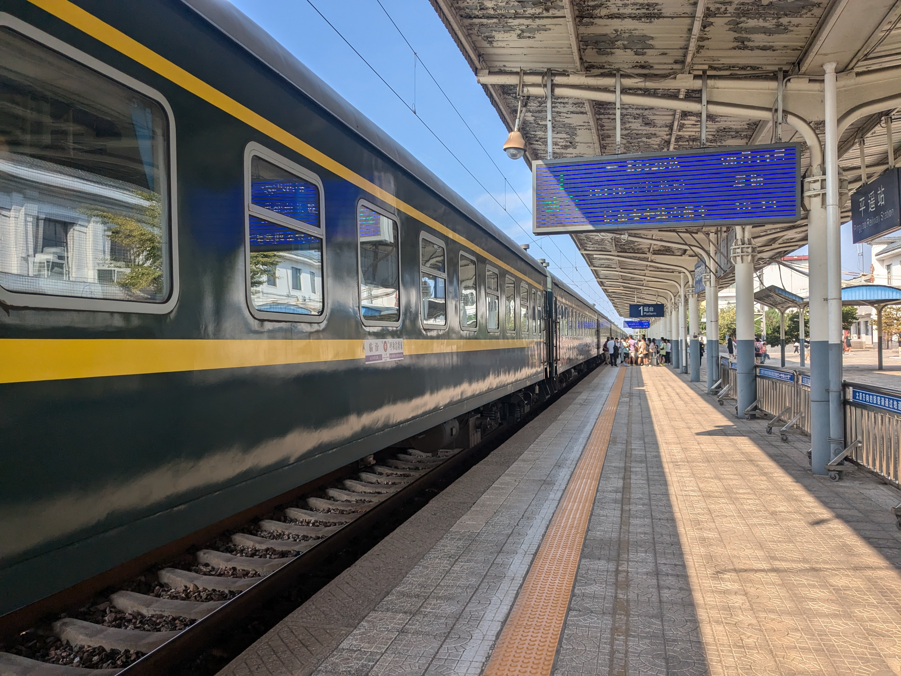

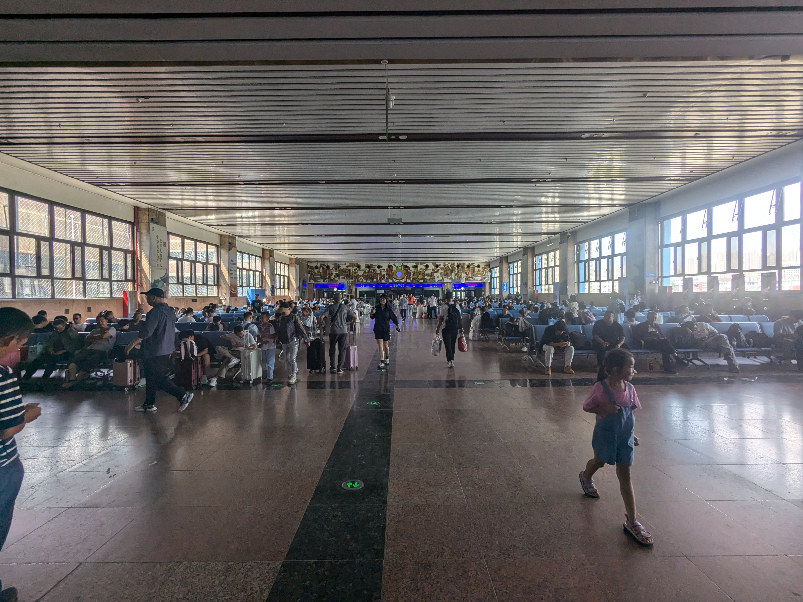

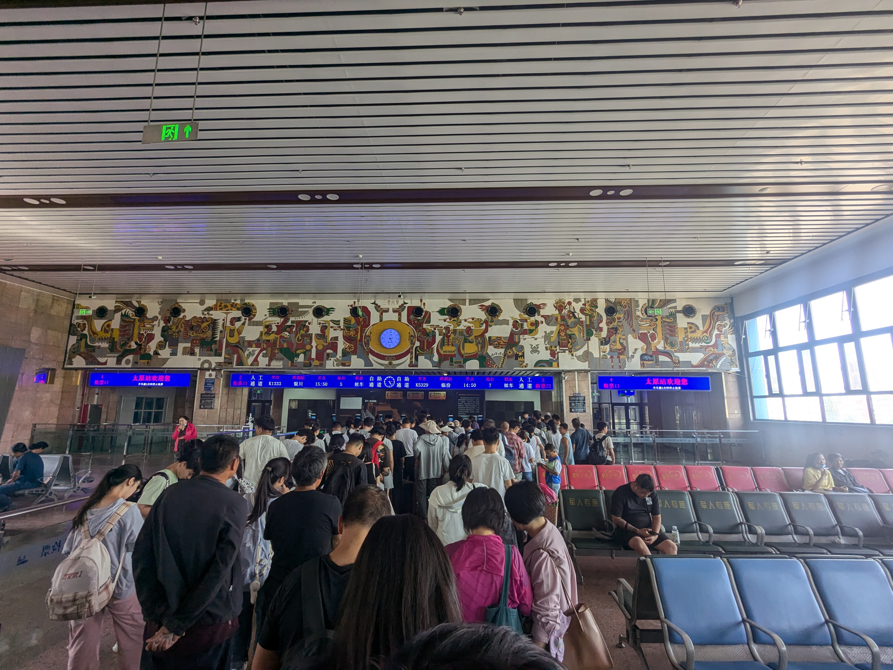

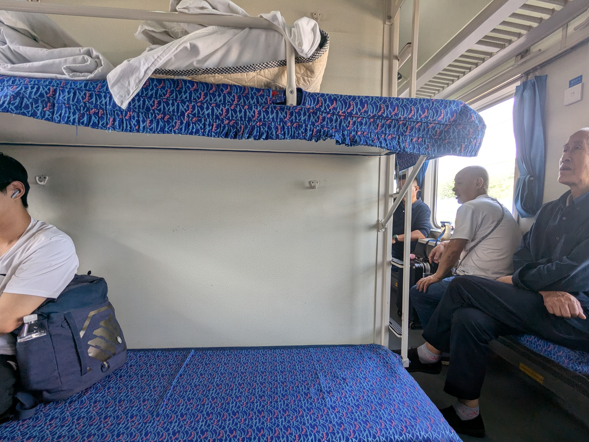

平遥
----
- 2024-08-14 18:23:57	俺この旅行から帰ったら一日挟んで仕事なんだ……という事実に気づいて無事鬱になった
- 2024-08-14 18:29:56	バックレて中国滞在延長するのはロックすぎるのでNG
- 2024-08-14 18:31:04	人間は荷物なしでも38,000歩歩くと疲れる
- 2024-08-14 18:32:27	これ初日はスマホ持たずに2時間半歩いた分が入ってないので参考値
- 2024-08-14 18:35:14	こんなの見せられちゃうと正直日本の重伝建はおもちゃみたいなもんね

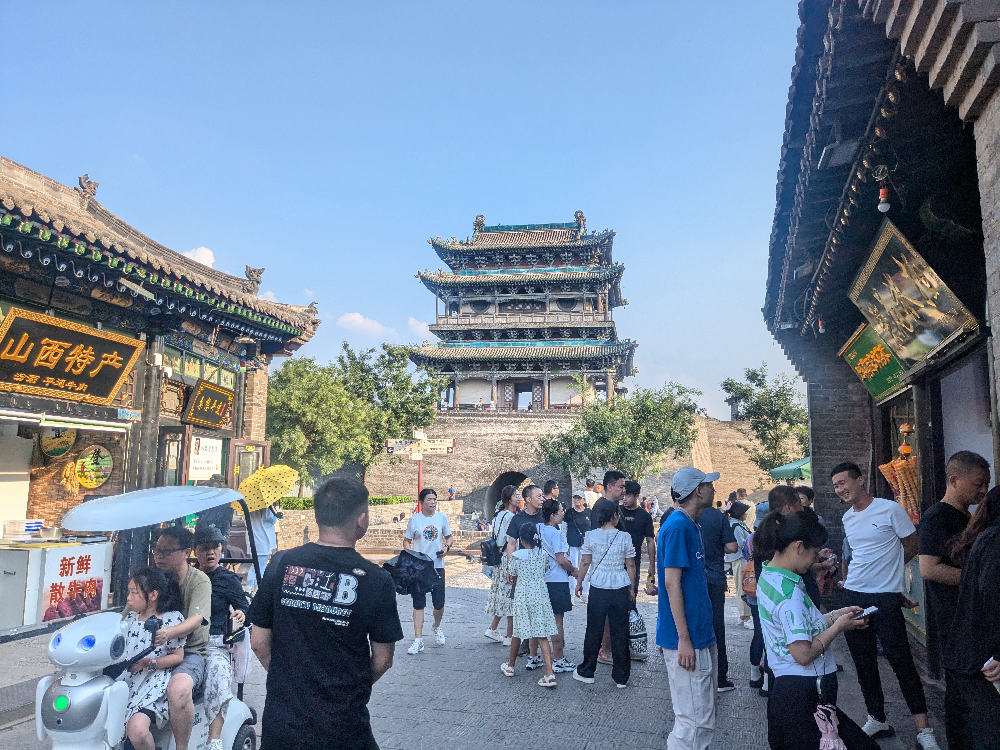

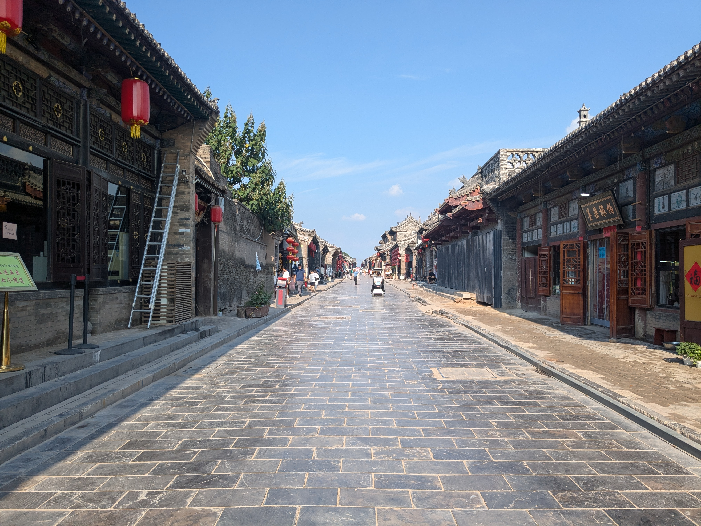

.. figure:: ./img/PXL_20240814_090731558.jpg

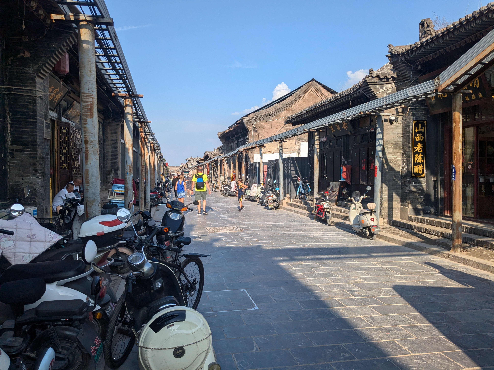

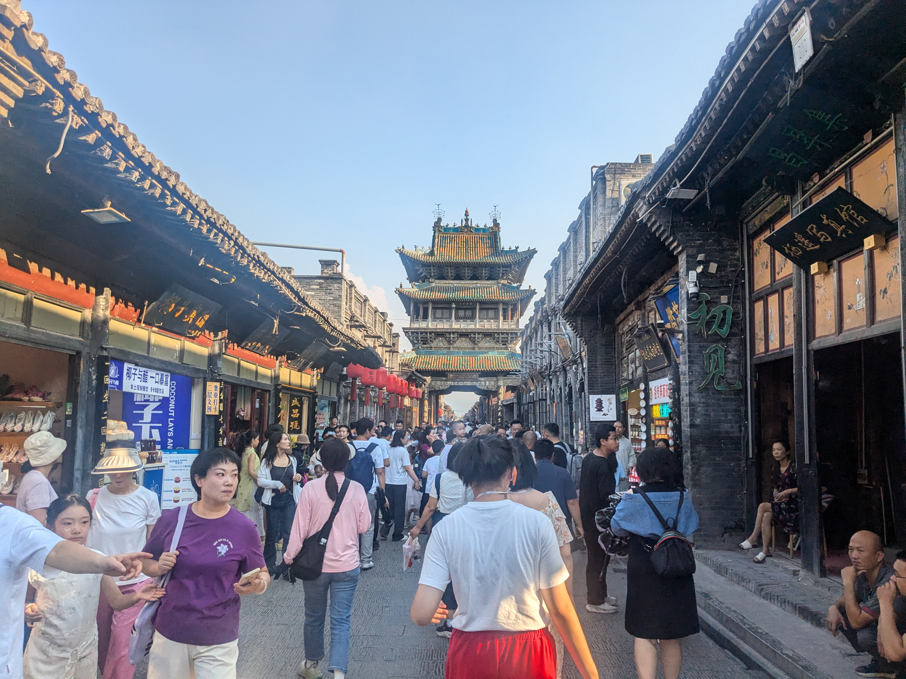

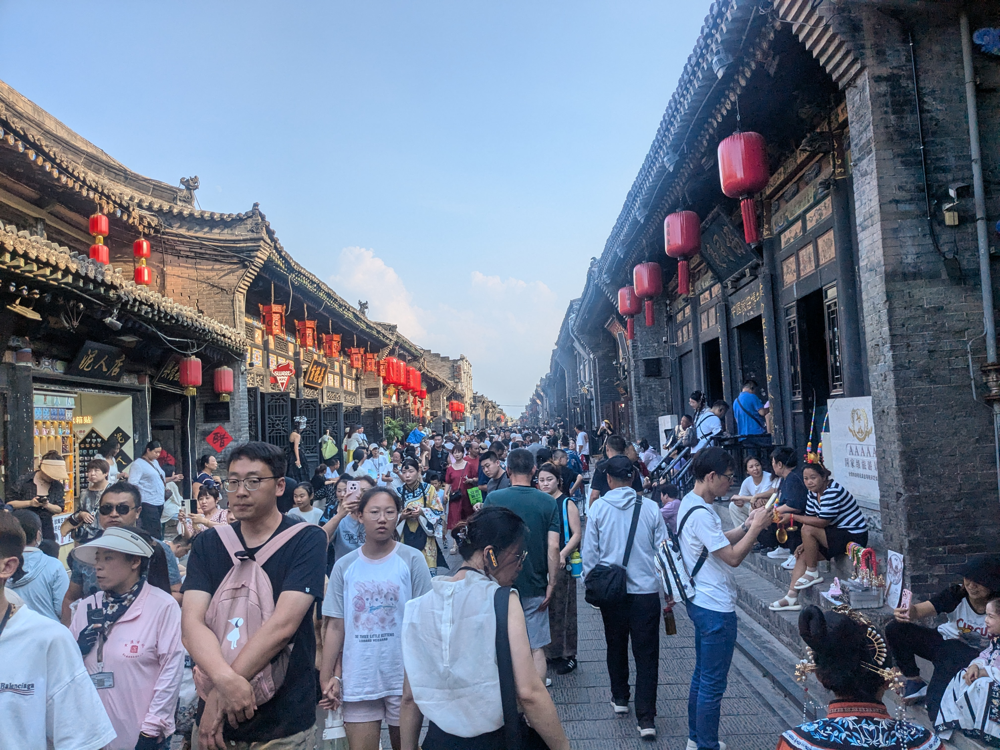

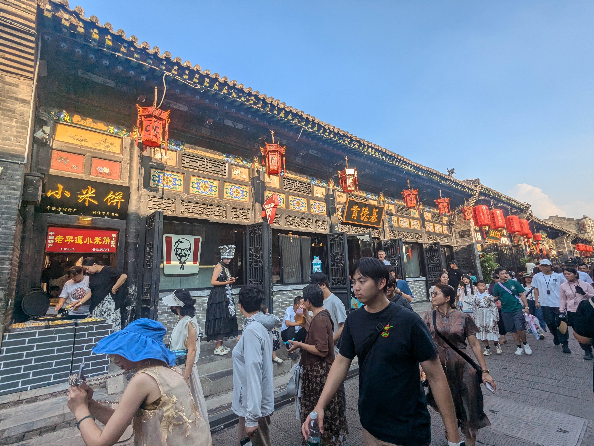

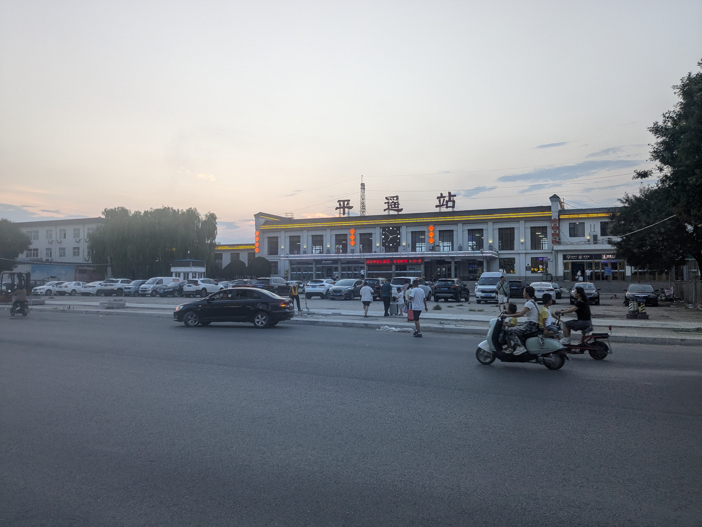

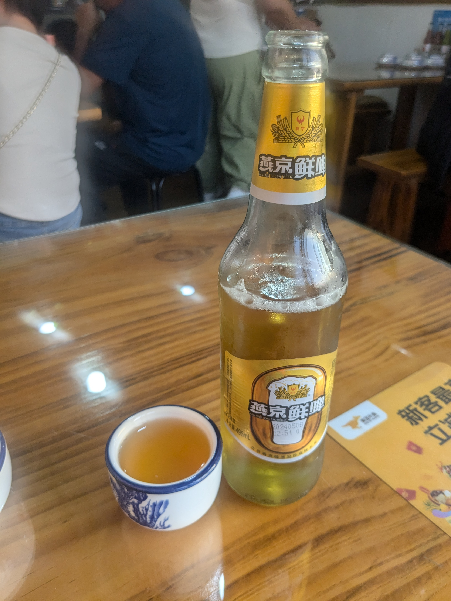

- 2024-08-14 19:48:03	普通の站前食堂が無いもので、メニューにない蛋炒饭を作らせる厄介客になってしまった
- 2024-08-14 19:48:41	蛋炒饭作れない中国人はいないからね、問題ないね
- 2024-08-14 19:51:38	西红柿入れてきたけどもうビール飲んじゃったので受け取ります
- 2024-08-14 19:52:52	作って持ってきてから行不行じゃねんじゃ
- 2024-08-14 19:54:42	チャーハンに入れる具が無いので迷った結果、メニューにある西红柿炒鸡蛋盒饭をベースにすればそれで金額設定できるんだろうと思ったんだろな
- 2024-08-14 19:56:09	なんで山西省に燕京あんだろうと思ったら、会社と工場が山西省にもあるんだね
- 2024-08-14 20:25:53	平遥のゆうべ

K610 平遥-北京丰台
------------------------
- 2024-08-14 20:42:01	乗る列車が遅れてるの初めてかも
- 2024-08-14 20:42:20	結果的に遅れたことはあるけど、そもそも遅れてくるのは
- 2024-08-14 20:42:32	始発から乗ってばっかりだから
- 2024-08-14 20:52:02	うおーん
- 2024-08-14 20:52:08	もう寝る
- 2024-08-14 20:52:19	電車来ない寝れない
- 2024-08-14 20:54:51	正直もうそろそろ开始检票するんじゃないか？という読みで列並んだ
- 2024-08-14 20:58:18	つかこの駅小さすぎて进京列车の二次安检もないわね

.. figure:: ./img/PXL_20240814_120926723.TS.mp4