8月17日_中山-深圳-香港-東京
#################################
D923 北京西-中山
======================
- 2024-08-17 11:17:56	甘いやつは持って帰って会社のおやつにしようと思うけど、肉使ってそうなやつは持って帰れないので朝ごはんのアテに

目を覚ましたらもう广州南站に到着していた。寝台の足元には軽食の入った箱が置かれておりちょっと驚いた。たしかにドイツの夜行列車では朝ごはんが出てくることが多いが、中国の普速列车にはない文化だったので少し意外だった。寝てる間に置かれているのはあまり気分のいいものではないが、高いお金を払っているのだからヨーロッパ並みのサービスがあってもよいだろう。とはいえ箱を開けてみると中身は微妙で、味付きチキンに豆菓子、麻辣タケノコと期待していた主食というよりおつまみセットみたいな顔ぶれだ。バナナチップスなどもあるが、それもヨーグルトにでも入れて食べたい代物だ。考えてみれば中国の朝ごはんと言えば包子，お粥、ゆで卵と塩気の欲しくなる顔ぶれだからそれと組み合わせろというのだろうか？普速列车の朝ごはんは逆にそれしかないところが多いからそれと組み合わせればうまく行くのかもしれないが、あまり中国鉄路のサービス精神は理解できなかった。予期せず中国らしい顔ぶれが揃ったので検疫に引っ掛かりそうな肉製品はどこかで包子を調達して食べることにして、残りはお土産代わりにすることにした。茶饼とミルクティースティックはたしかに給湯器の乗った中国鉄路らしいサービスだと思った。

ずっと見ていたマカオの予報通り [#]_ 、珠三角は雨が降っている。列車は广珠城际铁路に入って200km/hに落ちたものの高架を滑らかに滑っていく。中国の「新幹線」と紹介される高铁の路線網も350km/hで走る新幹線らしい区間もあれば、こういう区間は最高速度も遅ければ駅間も非常に短く、都市圏内の中電的な役割を果たしていることもある。200km/hは中電にしたら速いのはそれはそうなのだけど。夜行列車が250km/hでかっ飛んでいくのも新鮮だったが、これだけの高架を走っていくのも他にはないかもと思う。川をいくつも渡っていく。乾燥した華北から一晩でこんな温暖で豊かな珠三角 [#]_ に来れるのは本当に革命的だと感じる。

中山には時間通りの到着。出站口が編成の後ろ寄りで12両分くらいをとことこ歩く。発車標を見て14分後に城际列车が来るのかと思っていたらそれは向かいのホームの話で、列車が着いたホームに7分後にはもう次が来るらしい。广深铁路が毎時3-4本あるから本数が多いことは認識していたが、こんなに本数多いところに夜行列車ぶち込んできてるのか。动车组列车だから性能差はそんなに大きくないんだろうけどね。でも次の列車は4両しかないらしい。16両の長距離夜行の後に4両の近郊電車。オタクはこういうギャップに弱い。

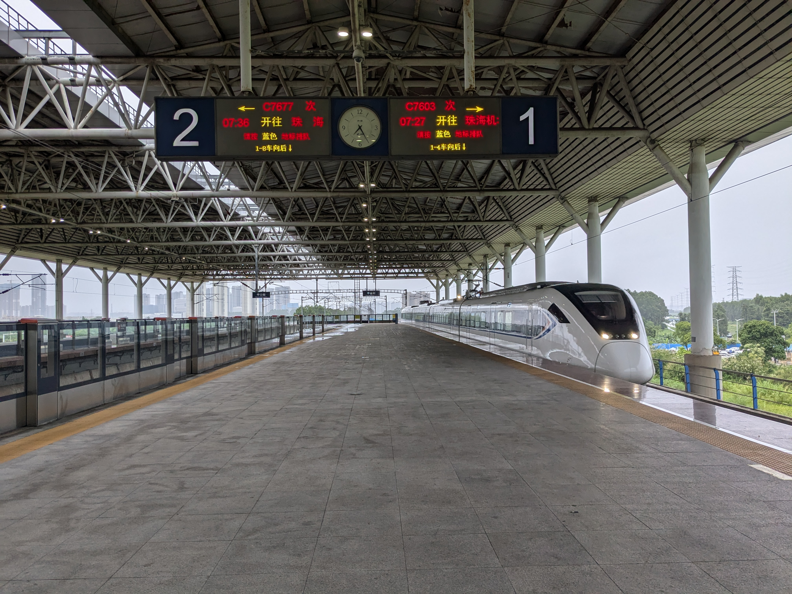

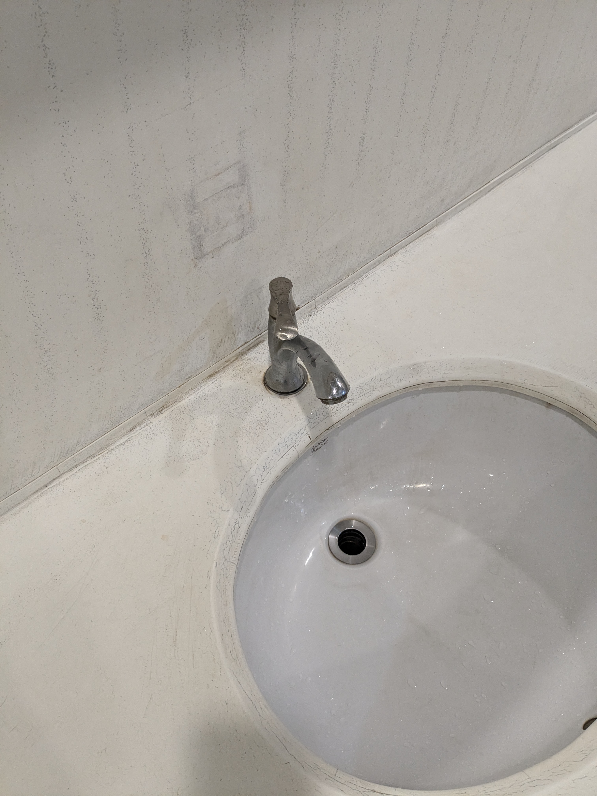

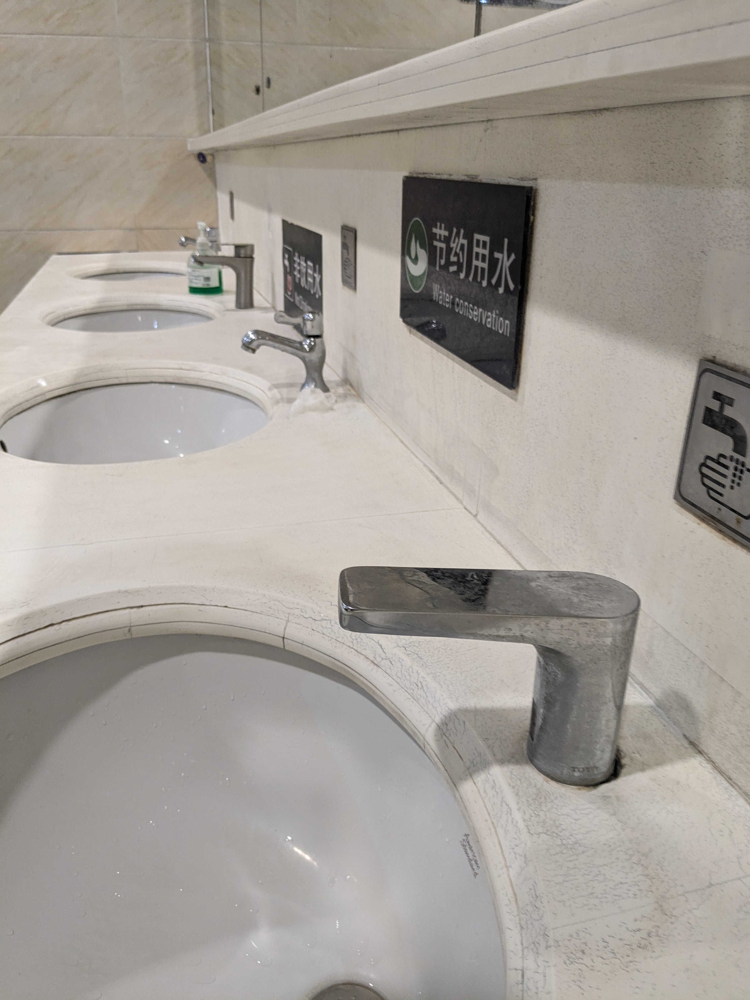

中山
====
- 2024-08-17 08:25:41	4両とか8両の短編成とは言えほんと本数多い
- 2024-08-17 08:28:30	ここの洗面台水栓の形全部違うんだけど

090路 城轨中山站-新村市场
-----------------------------
- 2024-08-17 08:49:23	バスが始発から私しか乗ってないのですがみなさんお休みなんでしょうか

駅を出る。散々中電とか近郊電車とか言ったが、中山の駅は高铁らしく街のはずれにあって、バスに乗って街まで行く必要がある。雨が降っているので悩んだのだけど、すっかり中国の公園に心惹かれていたので、紫马岭公园を通って中山博览中心に行くことを決める。あんまり雨の中でバスを待つ気にもならず、先に090路が来たというのが大きいけれど。最初は郊外らしい広い道路を走っていたけれど、中心部に向かうにつれて起伏も合ってなかなか楽しい街を進む。なかなか人が乗って来なかったけれど、目的地に着くころには格好のつく程度にはなった。結構雨が降っていてレインウェアを下も着る。下りたのは中心部というほどではないので、店やビルはあるけれど朝からやっているところはない。公園の目の前で降りてしまったので仕方ない。まずは公園を抜けよう。

紫马岭公园
-----------
別にどうということのない公園なのだが、池があって、起伏があって、動物園もあって、ただ歩くだけでも楽しい。こうした公園が日本にいくらあるだろうか？公園の南端に香山书房という綺麗な建物があるが、行ってみてもなんなのかはよくわからなかった。

深中跨市公交T01A路 博览中心-前海湾地铁站
-------------------------------------------------
- 2024-08-17 10:03:09	深中跨市公交は20分おきとか書いてあったけど、人集まったら都度出してそうね

雨の中を歩いてきたとあってずぶ濡れになってしまった。博览中心はやっぱり名前通り見本市会場のようで、ご飯が食べれそうなところは見当たらない。しかも屋根があるように見せかけて穴あきなので雨避けの役にも立たない。さっさと敷地を西に向かってバス乗り場に向かう。深中通道は6月30日に開通したばっかりの道路で、伶仃洋 [#]_ の東にある深圳と、西にある中山を結んでいる。西側は海上橋、東側はトンネルで東西ひっくり返した東京湾アクアラインみたいなものだ。 [#]_ ありがたいことにこの道路に合わせて深中跨市公交というのが走るようになり、18元で湾のこちらから向こうに渡してくれる。開通したのでせっかくならと早速乗りに来るためにわざわざ深圳から香港に戻るのに中山行きの动卧としたわけである。

既にネットで微信使えなくても乗れるということだけ見ていたので、乗り方はあまり心配していなかった。バス停の場所もどこなのかよくわかっていなかったが、普通に博览中心の北隅にまとまっている。博览中心の建物にそれっぽい建物があって覗いてみたが、どうやら空港アクセス関連 [#]_ っぽかったので撤退。無事バスターミナルに入って售票口に向かう。微信小程序を使えと言い、客にアプリでの予約の仕方を教える窓口係になんとか微信は使えないので切符を売ってくれと頼む、が返ってきたのは崩された18元と2元だった。そこで途中の「（你有）没有零钱 [#]_ 」「上车投币 [#]_ 」とか言ってたような言葉を理解する。そうなんだ、微信小程序でチケット買えとか言ってるのに普通に現金でも乗れるんだ。すごく拍子抜けしてしまった。 [#]_

無事に検察係も突破して乗車。混んでいたので後ろ寄りの通路席になってしまったが、雨に濡れて疲れていたので諦めた。

橋は片側4車線の立派なもので、開業直後は大渋滞となったのが信じられない快適さだった。アクアラインを2車線で作って大渋滞させている日本も日本だが、さすがに過剰投資としか思えない。土木フリークとしては夢のある国ではあるが、本当にこれでいいのだろうか。

しかし深圳は山や畑が目立った中山側に比べて見事な高層ビル群が広がっている。福田や南山などはともかく深中通道を渡ったこのあたりからこんなにも違うのか。

深圳
====

前海湾はまだまだビルが建設中で殺風景ではあるが、駅前には屋台がいくつか並んでいて助かる。中国で屋台は見かけないわけではないが、どこにでもあるというわけではない。少ない経験からすると深圳は比較的よく見かける街のような気がする。他に今回の旅で記憶にある街は惠州，张家界，兰州あたりだろうか。包子，油条，お粥など一般的な朝ごはんが地下鉄駅の入口で簡単に手に入る。この手軽さは本当に素晴らしい。

11，1号线 前海湾-车公庙-华强路
--------------------------------------
- 2024-08-17 11:05:21	地下鉄の駅前で調達したクタクタの油条で朝ご飯
- 2024-08-17 11:06:05	米の焼売うまあ
- 2024-08-17 11:06:30	中国人は朝は炭水化物しか取らない縛りでもあるの
- 2024-08-17 11:09:02	深圳は新しい街だからかなのか、朝の地下鉄駅前に屋台がたくさん出ているのは本当にいいところ
- 2024-08-17 11:09:53	惠州の駅前にもいたし、広東省が多かったりするのかな
- 2024-08-17 11:13:10	11号線時刻表にはないのに、岗厦北と福田行きが交互に来る
- 2024-08-17 11:16:14	軽食微妙ってのは炭水化物がなくておつまみになりそうなやつばっかりだったことです。ようやく炭水化物を調達出来たのでちょうどいい
- 2024-08-17 11:16:58	もしくは甘いものか
- 2024-08-17 11:17:56	甘いやつは持って帰って会社のおやつにしようと思うけど、肉使ってそうなやつは持って帰れないので朝ごはんのアテに
- 2024-08-17 11:28:42	いつの間にか地下鉄に弱冷車と強冷車の区別が出来てたよね
- 2024-08-17 11:32:41	车公庙で1号線乗り換えようかしら
- 2024-08-17 11:33:14	弱冷房つったのにめっちゃくちゃ冷えてるんですけど
- 2024-08-17 11:46:10	ホームあったけえ
- 2024-08-17 11:49:52	ちょっと足が濡れたりしてたとしても、往時のSSなんかよりよっぽど冷えてた

早速ホームの椅子で朝食を済ませる。香港、台湾、シンガポール、世界的にはどこの地下鉄も飲食には厳しいが、これくらいなら許される。11号線は福田行きと岗厦北行きが交互に来る。地铁通では全部岗厦北行きなのでこのアプリもあまりあてにはならないらしい。

さっさと香港に入って香港で遊ぶか、それとも深圳で遊ぶかでしばし悩む。考えてみればビザを取らないと来れない深圳と、いつでも来れる香港では悩むまでもないだろう。深圳ですら気軽には来れない [#]_ 現状は本当にナンセンスで悲しい気持ちになる。せっかくなのでまずは华强北に行くことにした。

電子工作の趣味は無いので少し覗いても何も分からないのだが、相変わらず得体のしれないものをいくらでも売っている。雨だからかひっきりなしに外卖のバイクが通り過ぎる。

？路 群星广场-少儿图书馆
--------------------------------------
しかし内地はバスが安い。さすがにもう1元で乗れる町はほぼなく、どこも初乗りは2元くらいするが、それでも世界的に安い部類に入るだろう。なのでたとえバス停一つ分でも二つ分でも雨ならバスに乗ってもいい気持ちになる。

荔枝公园
--------
- 2024-08-17 12:51:02	最高ですね
- 2024-08-17 12:51:29	この2棟は過去に深圳で最も高いビルだったことがあるけど、今はもう違う
- 2024-08-17 12:54:14	一旦中国で大陸サイズに慣れちゃうと、日本の島国サイズじゃ何にも思わなくなっちゃうよね
- 2024-08-17 12:55:44	やっぱビルは400mからだよね

.. figure:: ./img/PXL_20240817_034820300.jpg

邓小平画像
----------
- 2024-08-17 13:03:37	ようやく坚持党的基本路线一百年不动摇できた

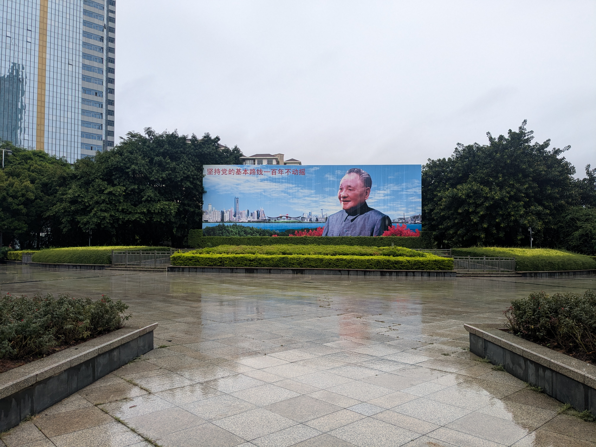

埔尾村
------

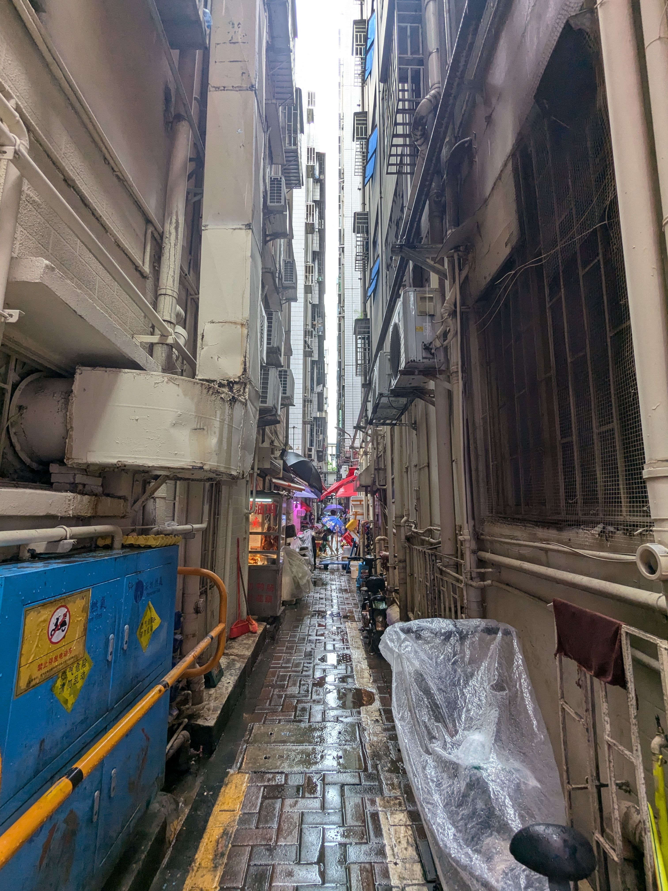

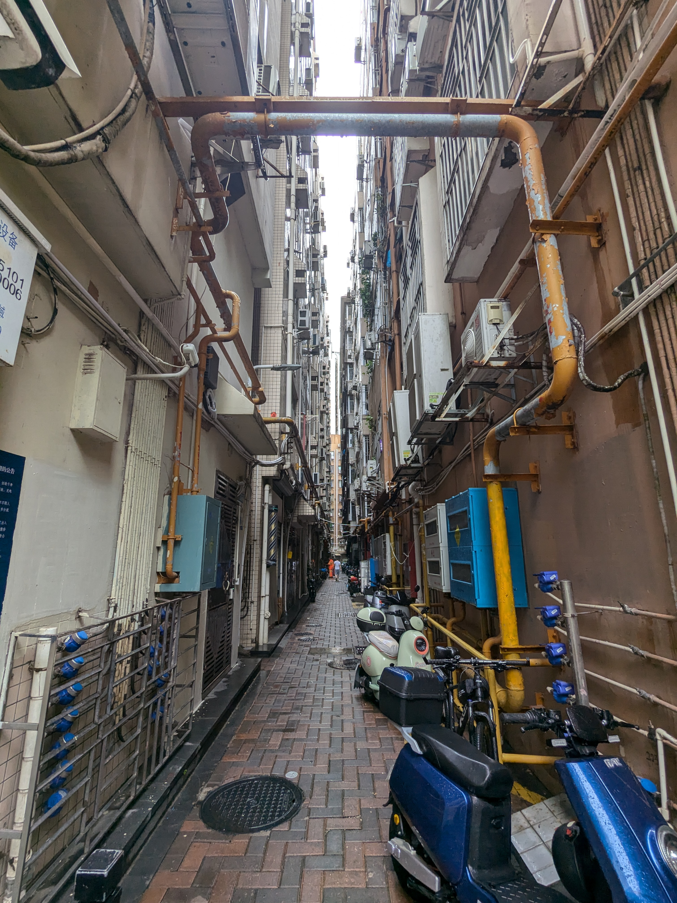

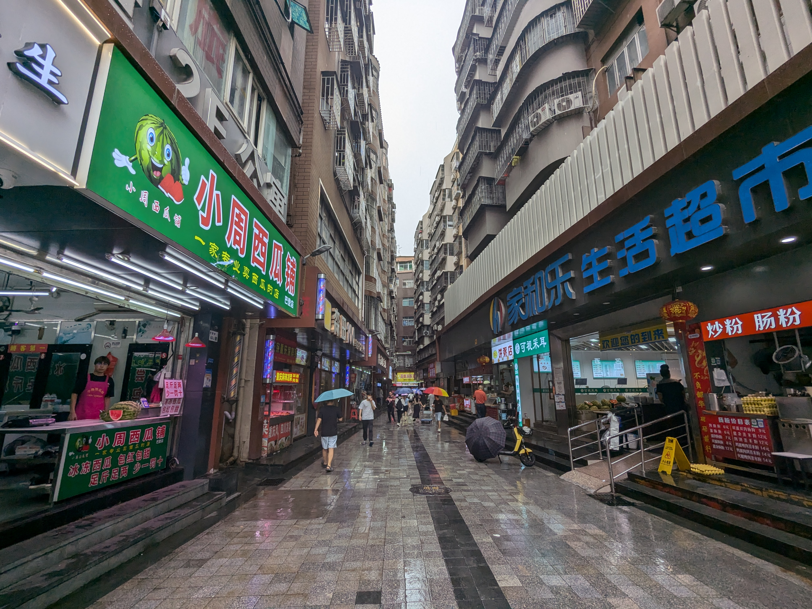

？路 市委-人民桥
------------------
深圳文和友
------------

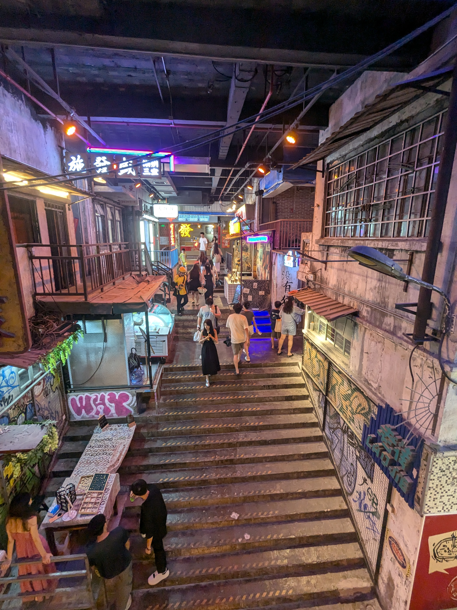

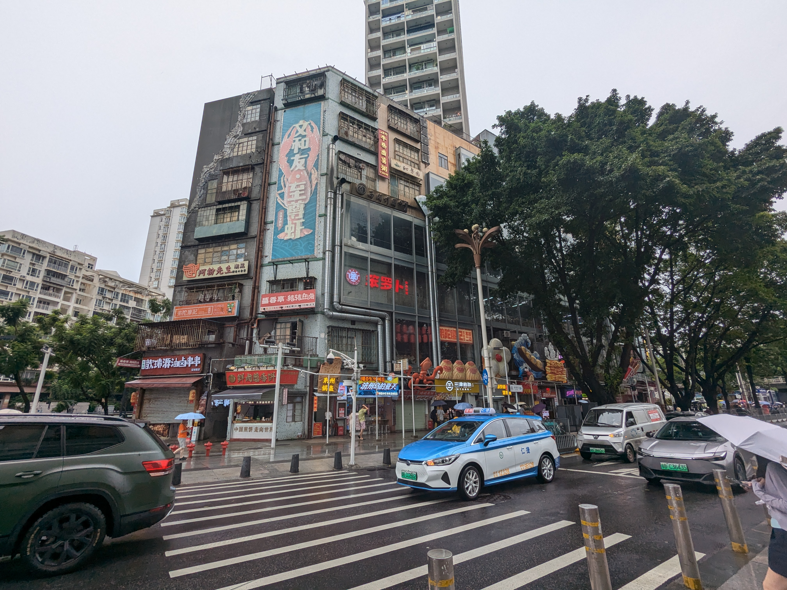

.. figure:: ./img/PXL_20240817_043450492.jpg

东门
----
？路 门诊部-莲塘口岸
----------------------
莲塘/香園圍口岸
======================

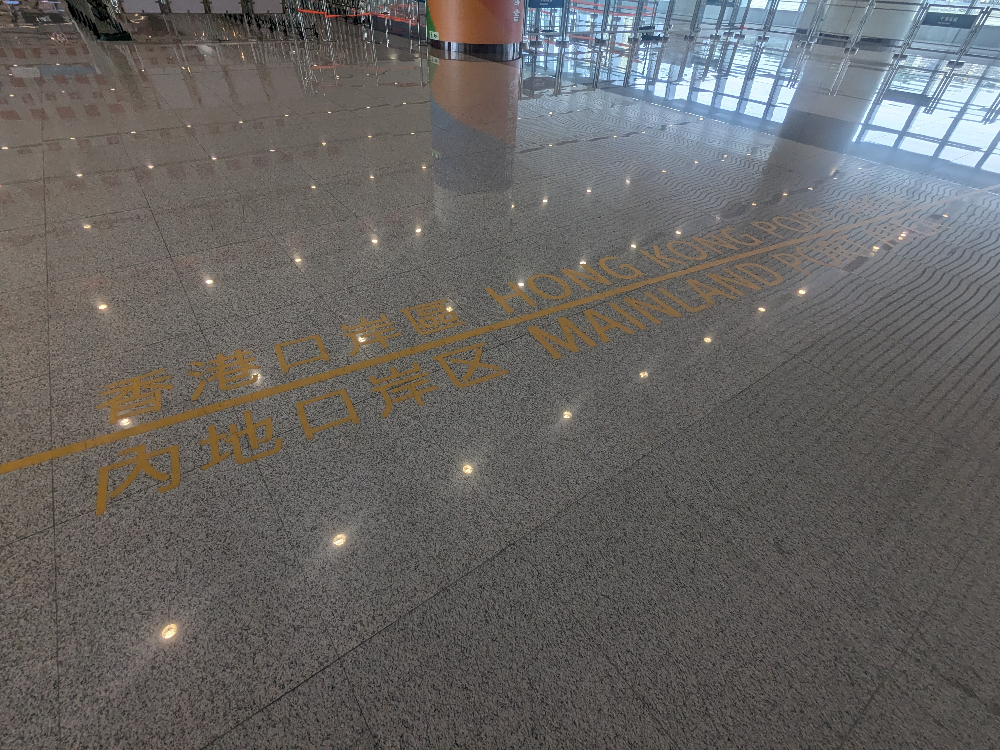

香港
====
B7 香園圍口岸-粉嶺站
--------------------
- 2024-08-17 14:58:34	うおおお、帰ってきた。香港は家
- 2024-08-17 15:00:57	中国は祖国、香港は家、冬の土日はスキー場で暮らして、東京には出稼ぎに来ています。こだてです。
- 2024-08-17 15:03:01	こんな生活してると深圳通と八達通が一枚に載った互通行は便利わね

673 粉嶺站轉車站-中環街市
------------------------------
- 2024-08-17 15:08:47	香港に帰ってくると香港ってめっちゃ文明だな
- 2024-08-17 15:24:30	あのペラい壁で支えてんの
- 2024-08-17 15:31:29	たぶん二度目の673してく
- 2024-08-17 15:40:07	香港来たけどどうすっかなあ、時間はあるような無いような
- 2024-08-17 15:57:05	とりあえず673に乗ってるんで香港島には行くんだが、スターフェリーで尖沙咀に戻ってきて飯食って260Xで屯門行って行きと同じく屯門赤鱲角隧道通って空港出るんかな、分からん
- 2024-08-17 16:00:38	いや、香港いいな、文明だな、丸亀製麺あるし
- 2024-08-17 16:01:44	交通事故で死ぬかもしれないってのと、衛生的にう〜んってのはよくあるけど
- 2024-08-17 16:01:22	中国ほんと治安は心配したことないなあ
- 2024-08-17 16:17:39	島で飯食ってくのもありかな
- 2024-08-17 16:30:36	いつも九龍からバス乗ってばかりだからたまには香港島から乗ってみるか

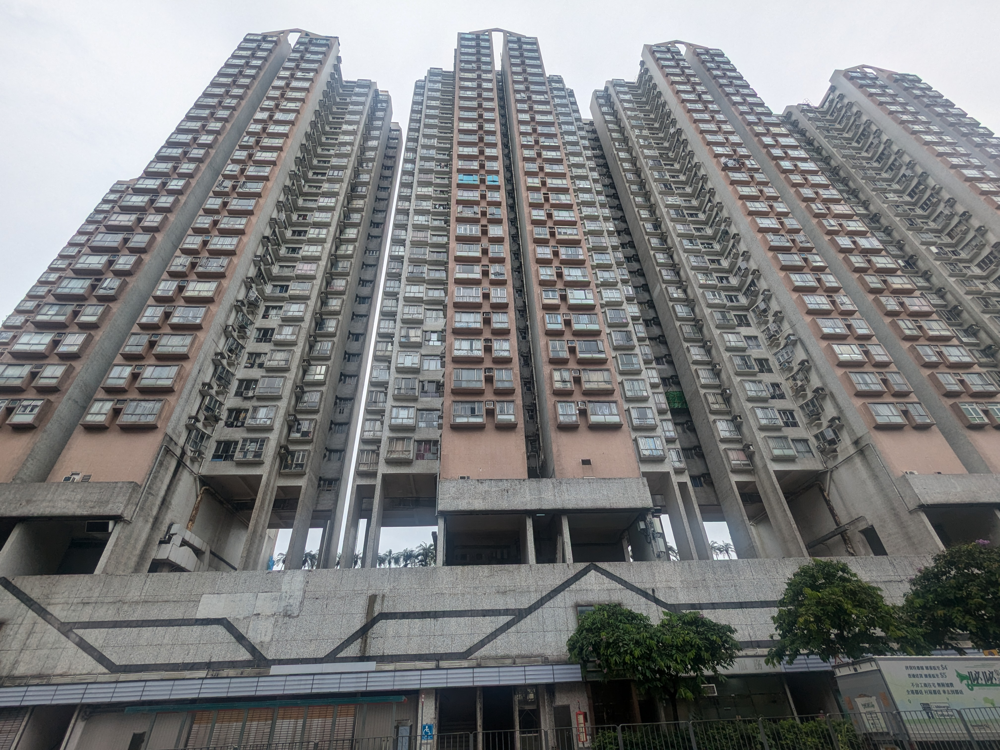

叉燒煎蛋飯
----------
- 2024-08-17 17:12:27	粵語に比べたら普通话は随分聞き取れるし話せるんだよなあ、香港そこだけは面倒

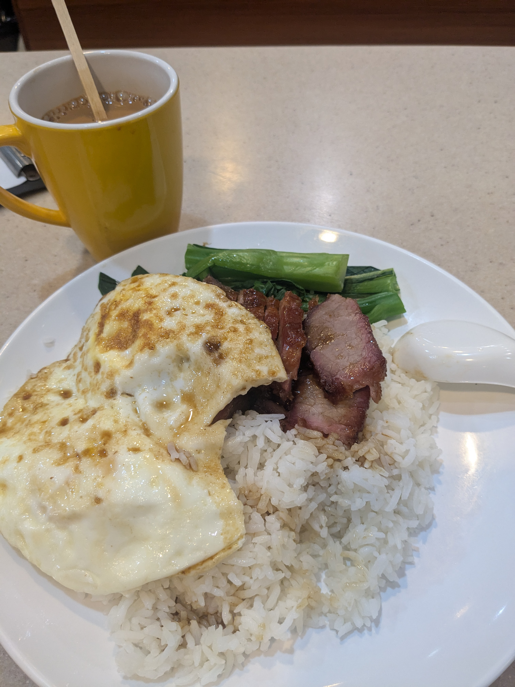

960 永吉街-屯門市廣場
--------------------------
- 2024-08-17 17:43:13	BBIってBus-Bus Interchangeなんだ
- 2024-08-17 17:48:48	西隧轉車站出たら次が屯門公路轉車站なの当たり前だけど改めて見ると遠いな。正直青衣あたりに轉車站あると便利なのだけど（大嶼山に入ってからではA・E系統の本数が少なくあまり恩恵を受けられないため）

.. figure:: ./img/PXL_20240817_085529010.jpg

A33X 屯門站總站-一號客運大樓
----------------------------------
- 2024-08-17 18:44:17	空港行きのバスに乗ったけど、電池がありませんわ〜〜〜
- 2024-08-17 19:23:30	バッテリー34%まで復活した助かる
- 2024-08-17 19:23:52	持つべきものは充電口付きの空港行きバス

.. figure:: ./img/PXL_20240817_092419454.jpg

UO628 HKG-HND
=============
- 2024-08-17 19:25:31	残高が負の八達通手放そうかと思ったけど、全部柄違うからコレクションにいいし、誰かと来た時に貸せるから持っとくかとなった
- 2024-08-17 19:37:22	https://tabizine.jp/article/572750/自動ゲートは年に3回か、さすがに難しいな
- 2024-08-17 19:44:53	香港空港のSmartone死ぬほど遅い
- 2024-08-17 19:45:06	結局5Gの表示は見なかった気がする
- 2024-08-17 19:45:48	マイレージプログラムは無理っぽいし
- 2024-08-17 19:47:13	gwかお盆は必ず香港に来るとしても、他で2回来るのはさすがに香港好きすぎるでしょ
- 2024-08-17 19:47:54	香港乗継で2回稼げばいいのか
- 2024-08-17 19:52:40	Gate 203ってどこだ……？
- 2024-08-17 19:53:55	列車に乗るっぽい、前と同じだな
- 2024-08-17 20:17:51	空港の充電バスより遅いんだけど
- 2024-08-17 20:18:53	しかしここでBFタイプとかイギリスですって顔しやがって
- 2024-08-17 20:21:41	なんかもう登機始めるらしい
- 2024-08-17 20:31:38	帰りは呼び出しもパスポートもチケットもチェック無しで搭乗。保安検査の前にパスポートとチケットの確認があるからそれでいいのかな
- 2024-08-17 20:32:05	ちなみに座席は5Aらしいです、めっちゃいいとこじゃね？
- 2024-08-17 20:42:07	ではみなさんおやすみなさい。こだての羽田脱出RTAは5時間後の予定です。

深夜の羽田空港を脱出する
========================
- 2024-08-18 01:20:46	着陸して回線が繋がったのでタイマー開始です
- 2024-08-18 01:22:51	宮崎県と紀伊半島は見えた
- 2024-08-18 01:24:03	コロナで蒲田行きバスすら絶滅してるのね
- 2024-08-18 01:37:10	東京クソあちいね
- 2024-08-18 01:38:18	3タミ死ぬほどタクシーいるのに全然列進んでないね
- 2024-08-18 02:37:58	というわけで、今回のトリビアの種はこういうことになりました。「こだては飛行機のランディングから1h17mで家に帰ることが出来る。」

.. rubric:: 脚注

.. [#] SIMがマカオだったらしく、スマホの天気予報がずっとマカオの天気を表示していた。
.. [#] 北京の街自体は為政者の努力もあって中南海をはじめとして水に溢れている。
.. [#] 珠江河口海域のこと。
.. [#] でもこっちの海上橋区間には斜張橋もある。港珠澳大桥もだが、橋とトンネルを併用するのはまだしも、なぜトンネルと長大橋を併用するのだろう。港珠澳大桥はまだ中央部のトンネル区間と、珠海澳门近傍のちょっとした斜張橋で役割分担が出来ていそうだが、こちらはほぼ中央部に立派な斜張橋がある。
.. [#] 深中通道は深圳側の出口を出てすぐ深圳宝安国際空港なので、そういう需要もあるのだろう。こうした立地も東京湾アクアラインっぽい。
.. [#] 20元を出したので、お前小銭無いの？的な発言だったと思われる。
.. [#] 繁体字なら「上車投幣」。
.. [#] 今回の旅で既に凤凰で切符買ってこいをさせられているし、思い出せば成田空港でもされた記憶があるので、すごく拍子抜けだった。TYO-NRTはちゃんとSuica端末付いているはずだし、東京駅からは乗れたような記憶があるので、未だによくわかっていない。
.. [#] 深圳であればアライバルビザがあるが1回限定、130元なので、昔のように国境を反復横跳びしたりは出来ない。
