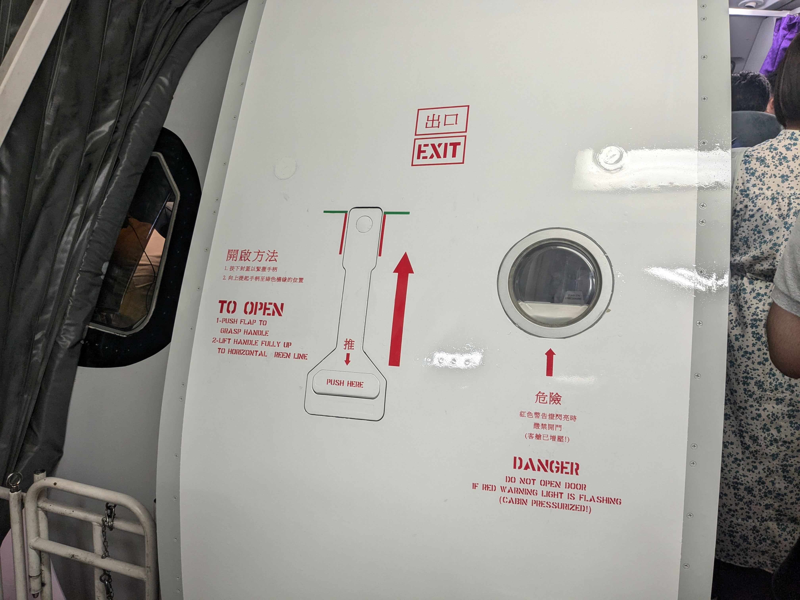
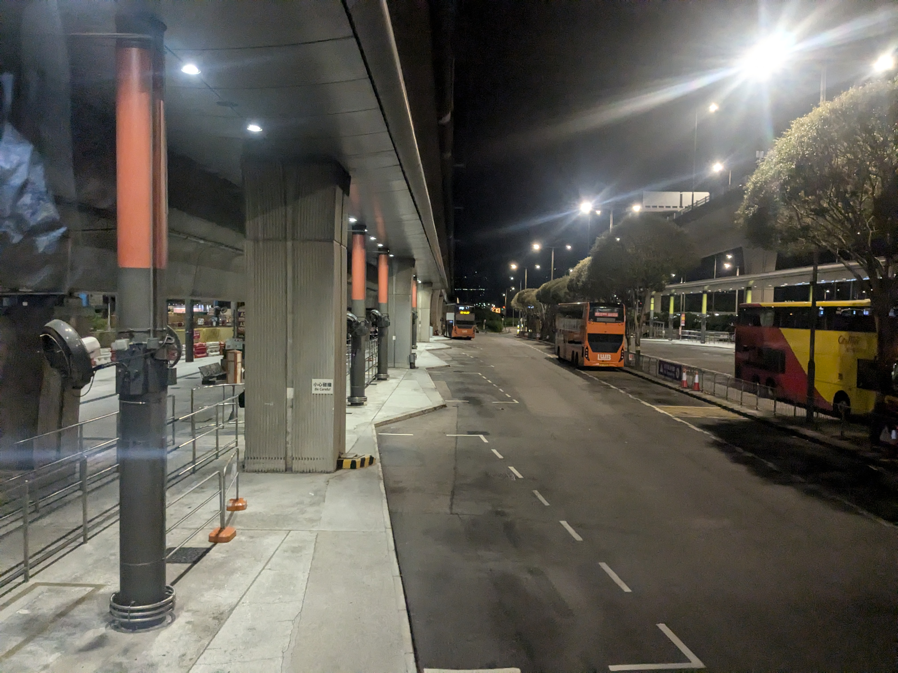
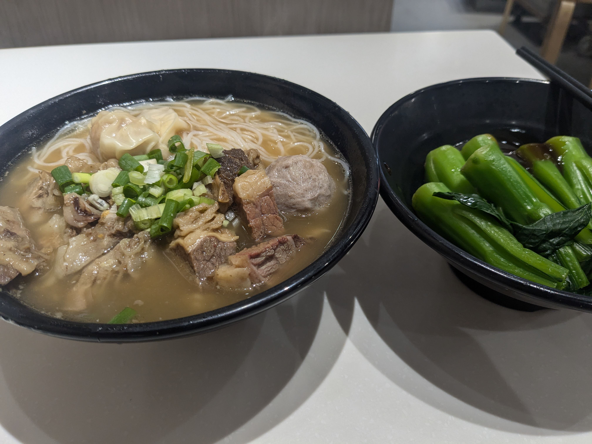
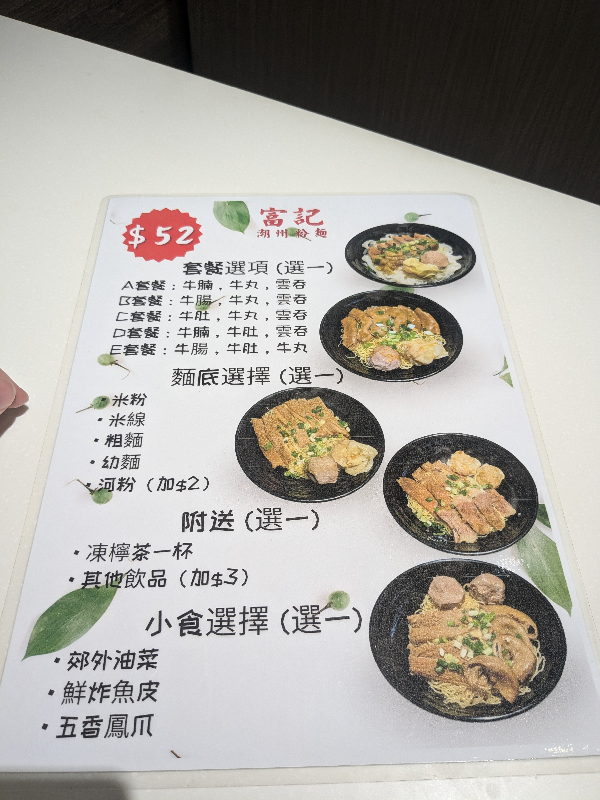
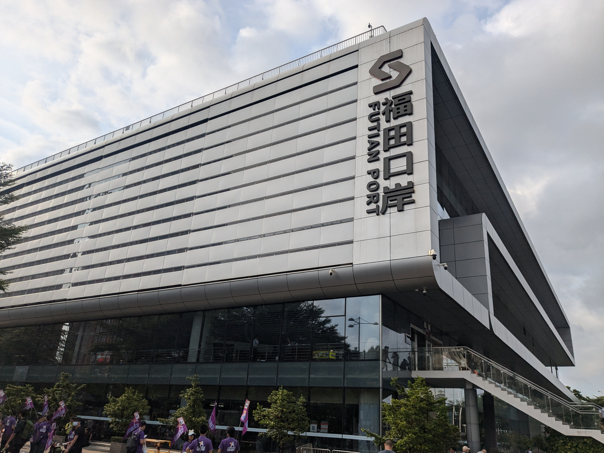
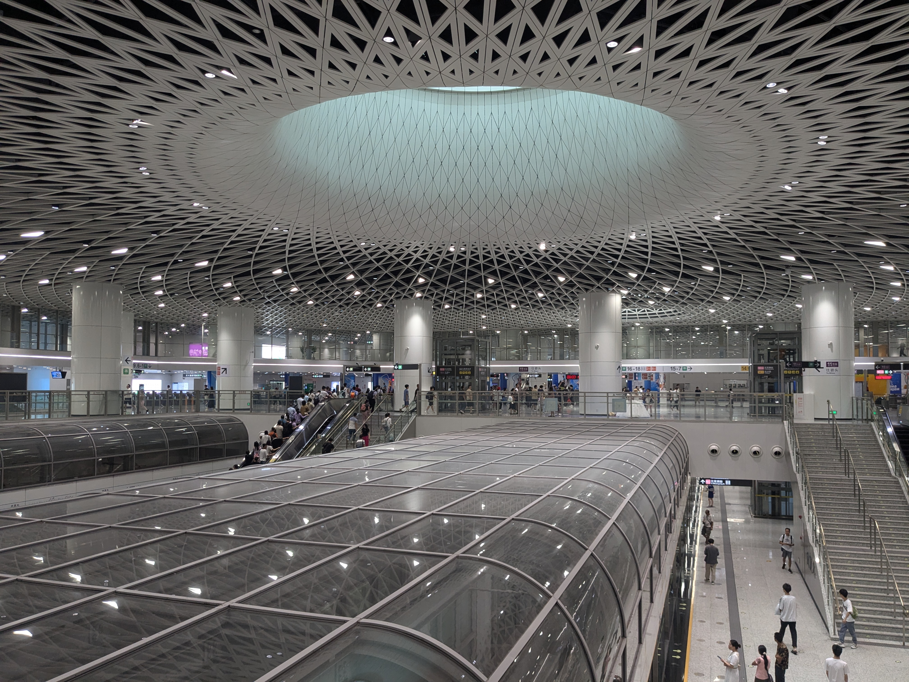
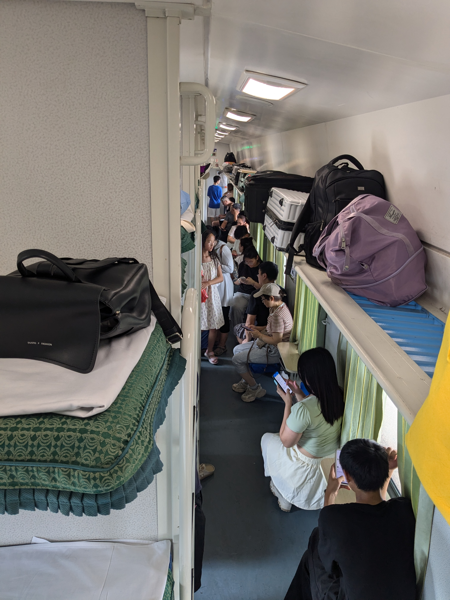
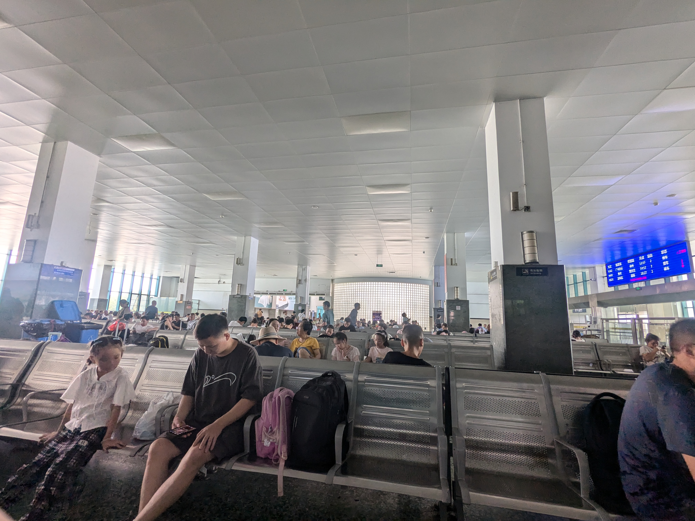
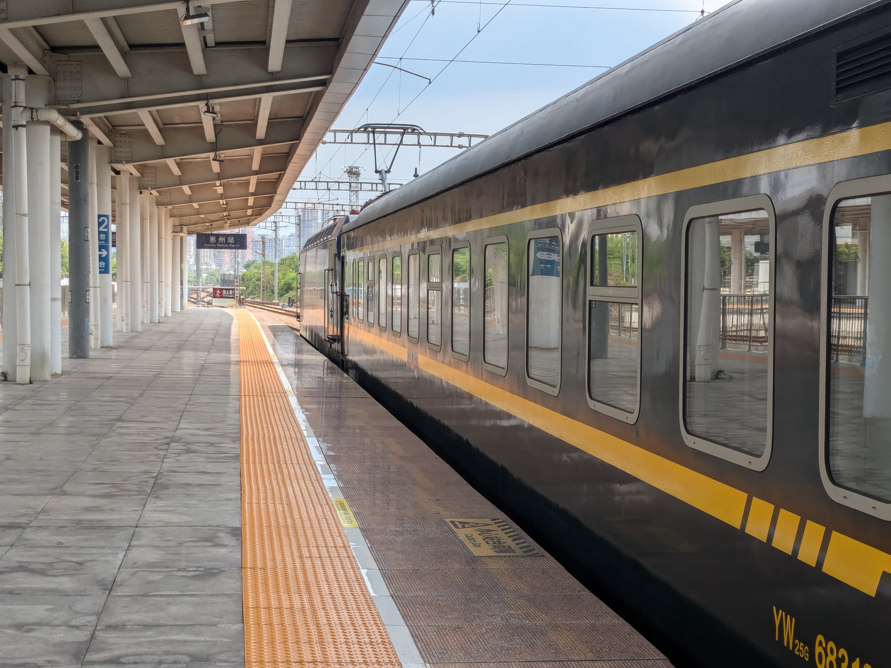

8月10日_東京-香港-深圳-惠州
##################################
8月9日
------
夏ダイヤのUO623便 [#]_ は羽田を01:10に出るので実質的には日付をまたぐ夜行便である。とはいえ時間は遅いので仕事終わりでもまったく問題はない。
しかし研究室の飲み会に参加することにしており、酒を飲んだら夜行バスに乗り遅れた経験 [#]_ を反省してアルコールは固辞して宴会半ばで帰る必要があった。

家ではシャワーを浴びるだけだが十分余裕を持って退散したため、予定より早い時間の電車に乗ることが出来た。
行きの電車でオンラインチェックインを済ませる。最後の最後でスマホの方はアプリでオンラインチェックインするように、という注意書きを眺めながらボタンをクリックしてしまいミスったなと思ってアプリをインストールしてみたところ無事にアプリにもオンラインチェックインの内容は反映されており搭乗券をアプリで表示することが出来た。

オンラインチェックインだとしても国内線だと保安検査場で紙が出てくるが、国際線はそれもなく完全にペーパーレスで飛行機に乗れるのかとワクワクしていたら搭乗口で呼び出されてパスポートと手荷物の確認をされてしまった。手荷物の大きさは気にしないらしい。1日を終えてスマホの電池が危なかったので充電しながら待つ。少し早く着きすぎたらしくコンセントは空いていた。

UO623 HND-HKG
-------------
お盆初日にもかかわらず周りは相当数が香港人と見える。円安のせいだろうか？ [#]_ 日本は2015年頃から観光客輸出国から受入国へと変わっているが、ますます訪日観光客ばかりが目立って日本人は海外旅行に行けない国になっていくのだろうか。 [#]_

    一応今から乗ります風の写真として。注意書きの繫体字が香港行きであることを物語ってくれる（たぶん）。

香港
----

香港に到着、と言っても2023年のGWにも来たからあまり感慨はない。全速力で入管に向かったためか入管が空いていてすんなり入境出来たのは助かった。Baggage ClaimのATMで現金を下ろす。人民幣も下ろせると書いてあったがその選択画面は無いように思えた。人民元建て口座のキャッシュカード向けサービスなのかもしれない。早速バスで空港を脱出しようと思うが、その前にはまず八達通 [#]_ にチャージする必要がある。手持ちの八達通はほとんど残高がマイナスだった [#]_ ので1回も使ったことのなかった互通行 [#]_ にチャージすることにする。機場快綫の運行時間前なので駅の充值機はまだ使えないらしい。どうしたものかと思ったが、八達通はコンビニでチャージ出来るのを思い出した。そうしてコンビニでチャージするだけして何も買わない迷惑な客になってしまった。

A36 機場（地面運輸中心）巴士總站-元朗同樂街
================================================

そんなわけでバスターミナルに来たもののまだ始発のバスが来ないらしい。空港をスムーズに出てこれたのはよかったが、少し順調過ぎたようだ。日の出前だというのに香港は信じられないほど蒸し暑い。中国が日本より暑いということはないのだが、普段昼間は空調の効いたオフィスにずっといるので、突然夏の屋外で観光をすることへの不安を感じざるを得ない。うちわで扇ぎながらバスを待つ。

    無事にバスの2階最前列を確保する。香港のバスはほとんど2階建てで、ロンドンよりもその比率は高いと思う。香港は南の方にあって子午線よりも西に位置しているから、夏の6時が近づいてもまだ暗い。

屯門赤鱲角隧道は2020年末に開通したので通るのは初めてだ。港珠澳大桥と合わせて珠江西岸と東岸の行き来に使えるというが、2回も国境を越えるのはさすがに面倒であまり使われているとは思えない。しかし以前は海を挟んでいた赤鱲角と新界西部が飛躍的に近づいたのは重要だろう。

元朗で朝ごはんにする。米線の店と盒飯の店でしばらく悩むが米線に決める。薦められるままに肉類4種盛りの米線にする。付け合わせを油菜にしたら青菜が出てきた。広東料理は薄味で関東人には少々評価に困るときがある [#]_ と思っているが、これはちゃんと塩味が効いており出汁が美味しい。潮州料理らしいから香港から少しでも北に行けばちゃんと塩味が効いているのだろうか？

B1 元朗同樂街-落馬洲站總站
==============================

落馬洲/福田口岸に向かうB1系統に乗る。このバスは国境地帯の山に行くにも使うので結構慣れているし、なんなら去年香港に来た時にも乗った。元朗を出ると市街地というよりはヤードなどの殺風景な風景が続き、香港らしい豊かな都会の雰囲気は消えて内地っぽさが深まる。向こうに見えてくるのは深圳のビル街なのだけど。

落馬洲/福田口岸
----------------

口岸というのは英語だとPortにあたり、日本語だと国境検問所、だろうか？香港と内地 [#]_ の間の陸路国境を渡るための施設である。香港は中国（中華人民共和国）だけど中国（内地）ではない、一国二制度 [#]_ を採用しているのでその間に国境 [#]_ が設けられている。現在香港と内地の間には西から順に8つの陸路国境 [#]_ が設けられているが、

バスターミナルは結構賑わっている。日本人にとっては越えづらくなってしまった国境だが香港・内地居民にとっては人によっては毎日通過する何でもない施設なのだろう。6年前には私にとっても。

6年前に初めて香港から深圳に入った時も

深圳 10，14，16号线 福田口岸-岗厦北-大运-回龙埔
------------------------------------------------------------

惠州 208路 龙岗汽车总站-火车站
------------------------------------

2024-08-10 10:00:34	深圳ではどこにも交通系ICチャージする手段がなくて終わったかと思ってたら支付宝で公交乗れそうでget事なき

K685 惠州-张家界西
------------------------

2024-08-11 05:38:01	中国の鉄道なくなったもの- 切符と换票 おかげさまで乗り方が分からん、でも到着30分前に起こしてくれるのは健在なので助かる- BGMとCM 高鉄には元々無かったからそれに合わせてなくしたのかも、静かになったのはいいけどBGM無いのはちょっと寂しい

.. rubric:: 脚注

.. [#] 冬ダイヤは23:50発なので出発日に注意が必要だ。
.. [#] スキーに行く前日にZoom飲みでスパークリングワインとシードルを空けてたら夜行バスに乗り遅れた。その時は翌日の始発の新幹線に乗ることでなんとかしたが、さすがにもう繰り返したくない。
.. [#] 2023年の香港からの訪日観光客数が211万人、日本からの訪港旅客数が34万人なので、円高円安に関わらず圧倒的に香港人が多いのは間違いない。韓台中はレベルが違うとしても、訪日観光客数において香港はたった一都市でその次に付けており、人口750万人の4分の1弱が日本に来ている計算になる。
.. [#] 香港版Suica。日本ではオクトパスカードと呼ばれることが多い。表記を八達通に統一したのは気分。
.. [#] 八達通は100元までは残高がマイナスになっても改札を出れるし、バスに乗れる。デポジットが50元なのでそれ以上のマイナスになるように乗れば少し得することになる。機場快綫が100-110元なのでうまく調整するとよい。
.. [#] 香港の八達通と深圳の深圳通が1枚のカードに乗っている。便利そうなので買ってみたが前回は他の八達通を使っていたので一度も使わないままだった。
.. [#] 薄味の中の素材の風味を楽しむものと思えばよいのだが、少なくとも日本の中華料理のイメージとはかけ離れており、あまり人にはおすすめできない。日本の中華料理は陳建民（四川料理）の功績が大きく、他には上海や東北の色が濃いと思われる。点心、雲吞、焼売、腸粉、あたりが広東料理の代表例だろうか。
.. [#] 香港、澳門、台湾と対比して中国共産党が統治する領域を公式に「内地」と呼んでいる。
.. [#] 中国語では一国两制。2019年の反送中運動以降北京政府の統制が強まっており、言論の自由や普通選挙などが脅かされていることはご存じのことと思うが、一国二制度のうち港人治港が爱国人治港に変わっただけで依然としてほとんどの領域で一国二制度の枠組みが残っている。使用言語も北京語の存在感が強まっているとはいえ広東語が優先される現状は、北京語が優先される内地とは異なるし、国境にボーダーコントロールが置かれているのも、香港にはビザなし渡航出来ても内地には出来ないのも国境管理に関する権利を香港特別行政区が手放していないから、と言えるだろう。
.. [#] "国"境ではないので当局は邊境とか邊界とか呼んでいるが、便宜的に国境と呼ぶ。出入国は出入境に言い換えられる。
.. [#] 港珠澳大桥/港珠澳大橋，深圳湾/深圳灣，福田/落馬洲支線，皇岗/落馬洲，罗湖/羅湖，文锦渡/文錦渡，莲塘/香園圍，沙头角/沙頭角。他には高铁/高鐵と高速船、空港がある。
