8月12日_重庆-成都
######################

重庆
----
2024-08-12 22:44:22	4回内地来て4回重慶行ってるらしい、好きか？

.. figure:: ./img/PXL_20240811_230628692.TS.mp4
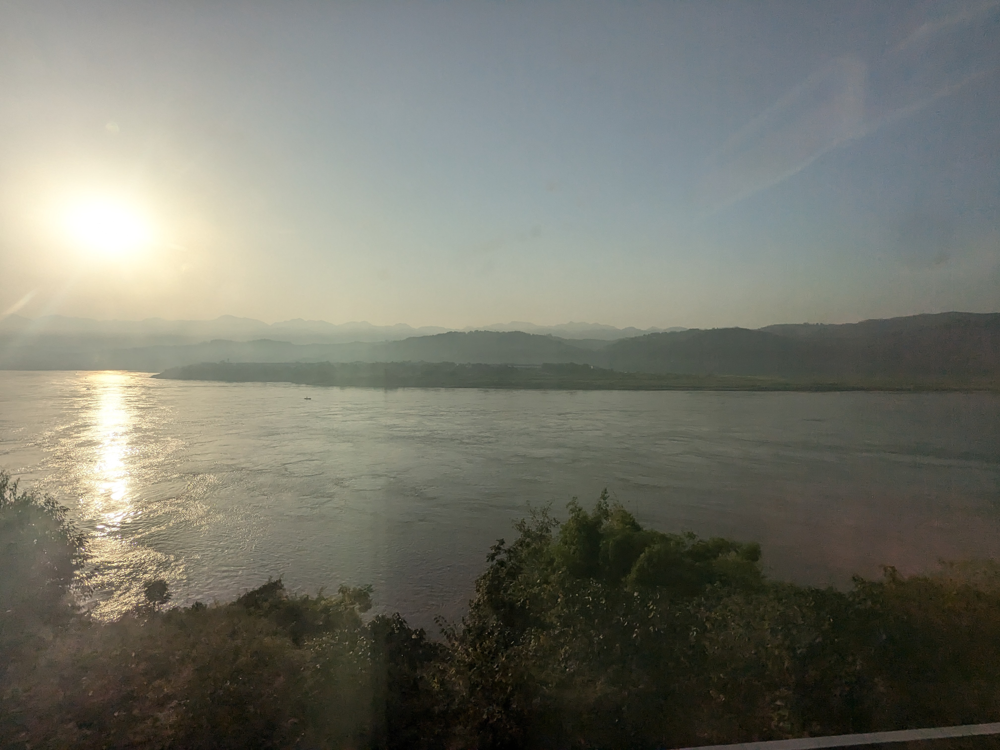

渝北・南岸
^^^^^^^^^^
凉面
====

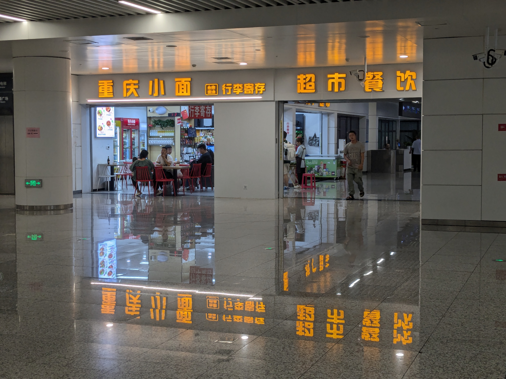

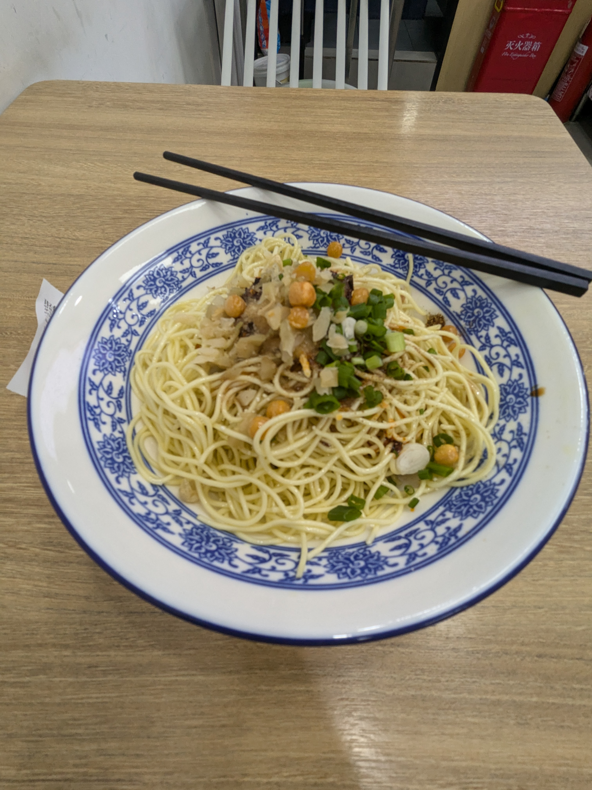

重庆轨道交通 环线
==================
2024-08-12 09:43:25	不辣的でも普通に辛いので牛乳でさっぱり

黄桷湾立交
==========

.. figure:: ./img/PXL_20240812_011208744.jpg

.. figure:: ./img/PXL_20240812_011101201.jpg

弹子石
======
两江小渡
========

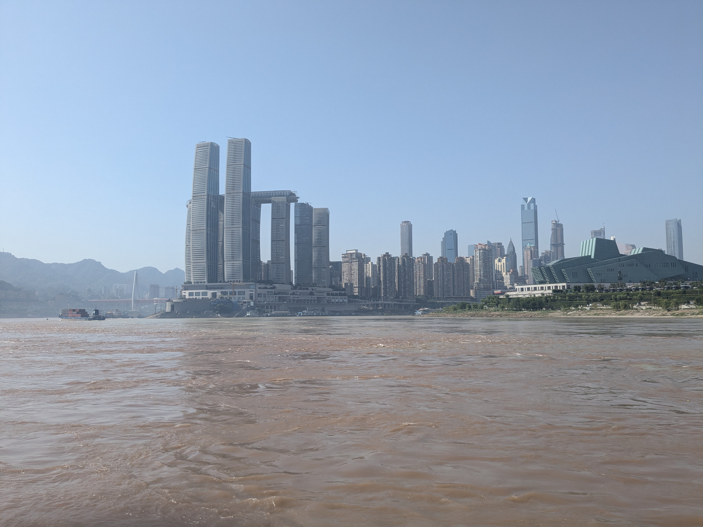

渝中半岛
^^^^^^^^
洪崖洞
======
大唐广场
========

.. figure:: ./img/PXL_20240812_024711975.jpg

好吃街
======

.. figure:: ./img/PXL_20240812_030454422.jpg

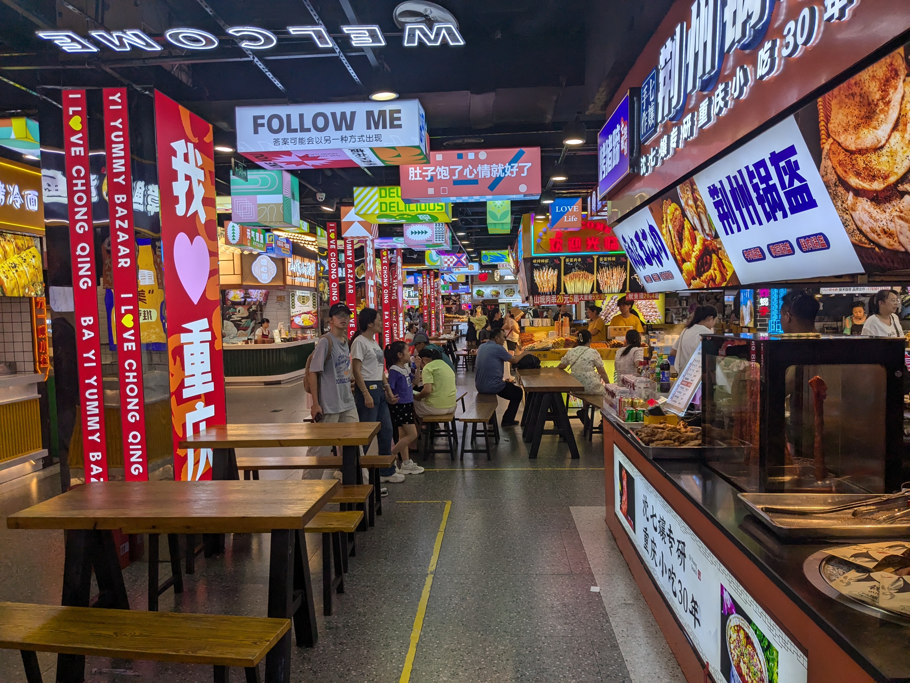

.. figure:: ./img/PXL_20240812_030225488.jpg

天桥
====

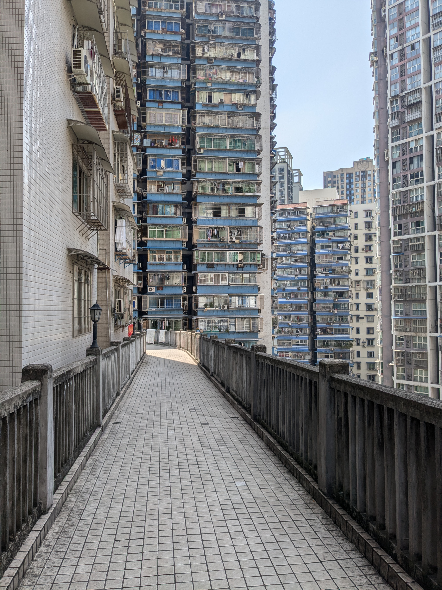

.. figure:: ./img/PXL_20240812_031305922.jpg

.. figure:: ./img/PXL_20240812_031412821.jpg

.. figure:: ./img/PXL_20240812_031443634.jpg

十八梯
======
山城步道
========

.. figure:: ./img/PXL_20240812_041021704.jpg

重庆轨道交通 1号线
====================

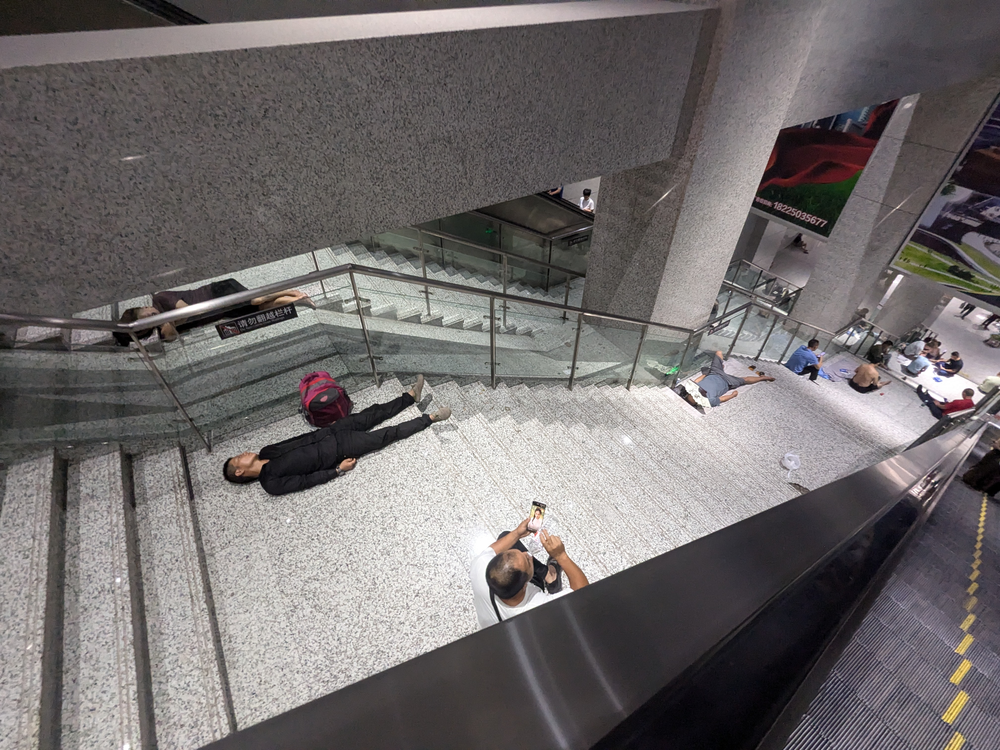

G8622 沙坪坝-成都东
--------------------------
2024-08-12 14:46:33	とりあえずポカリスエットで整ってる
2024-08-12 14:57:30	复兴号のコンセント自分の座席の下とか結構トリッキーなとこにあるね

成都
----
2号线 成都东客站-春熙路
^^^^^^^^^^^^^^^^^^^^^^^^^^
太古里
^^^^^^

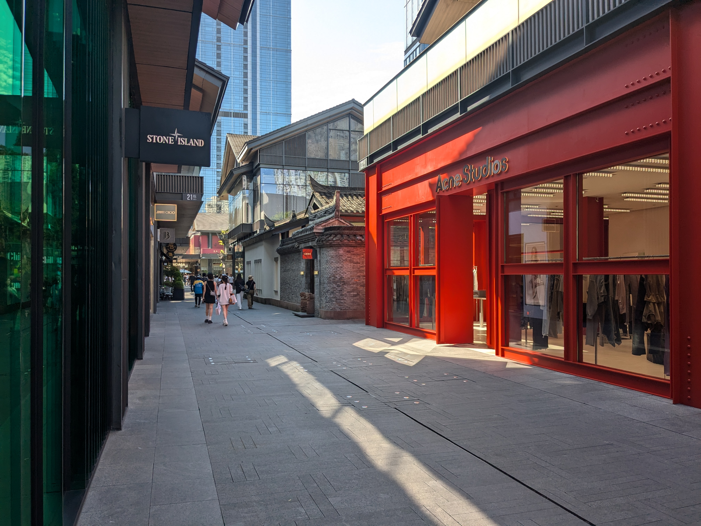

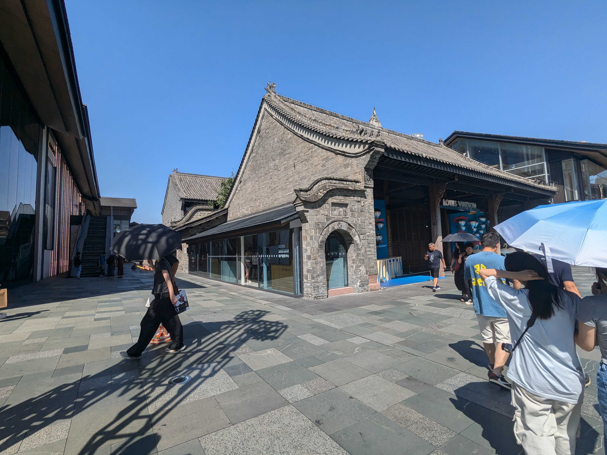

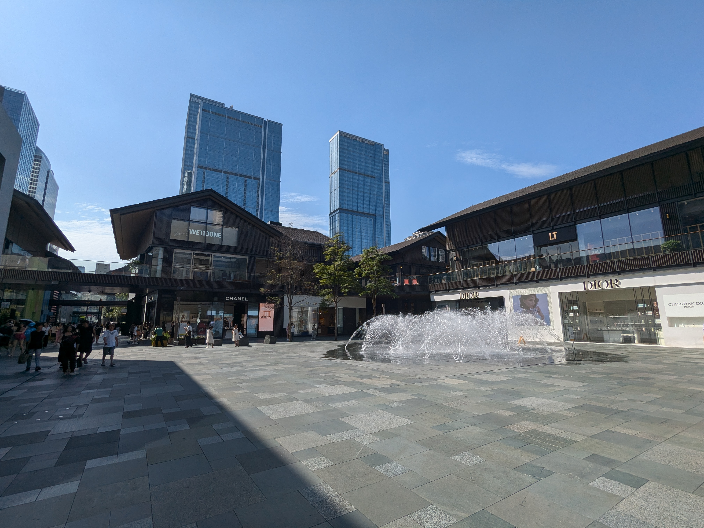

4路 蜀都大道红星路口-东城根上街
^^^^^^^^^^^^^^^^^^^^^^^^^^^^^^^^^^
人民公园
^^^^^^^^
2024-08-12 18:30:25	今回の旅で一番やりたかったこと
2024-08-12 18:56:15	ビオフェルミン効くのかな
2024-08-12 18:51:29	人は唐辛子に勝てない
2024-08-12 18:51:19	四川はマジでお腹壊すのだけなんとかなれば……（ならない）

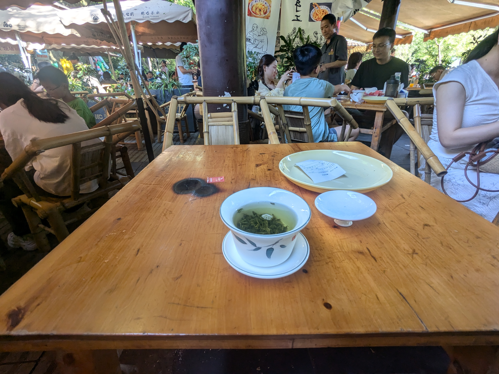

宽窄巷子
^^^^^^^^

.. figure:: ./img/PXL_20240812_103516871.jpg

4，3号线 宽窄巷子-市二医院-春熙路
^^^^^^^^^^^^^^^^^^^^^^^^^^^^^^^^^^^^^^
2，4号线 东门大桥-中医大省医院-成都西站
^^^^^^^^^^^^^^^^^^^^^^^^^^^^^^^^^^^^^^^^^^^^
K2616 成都西-兰州
------------------------

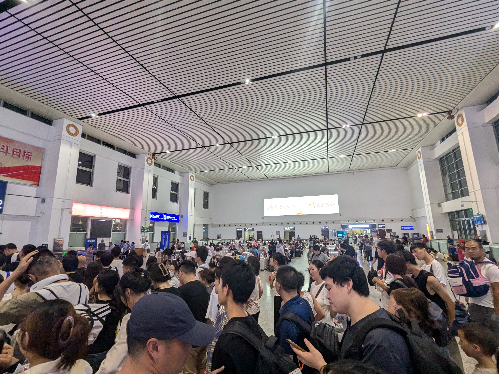

2024-08-12 21:55:00	子供と離れ離れにならないように、中铺と上铺を交換したけど額面違うから列车员は嫌うよね